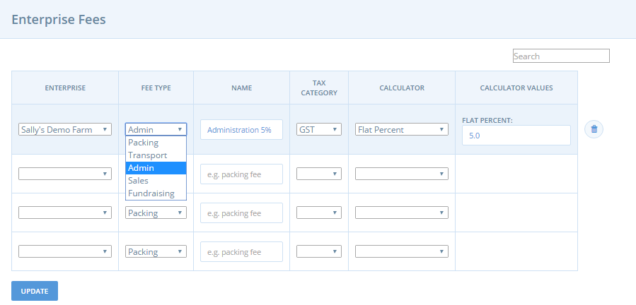

# Comissions de l'organització

Les comissions de l’organització són més rellevants per a productores, xarxes, grups, que treballen conjuntament en activitats de vendes i distribució. Permet assignar costos associats amb administració, embalatge, transport, vendes i recaptació de fons a les diferents parts. També s'utilitza habitualment com un mitjà perquè l’intermediari pugui aplicar un marge per als seus serveis o perquè els petits grups puguin finançar-se per poder fer front a les despeses del dia a dia. Per a petites productores individuals que només venen els seus propis productes aquests costos s'incorporen al preu de les mercaderies i l'enviament, per la qual cosa normalment no es necessiten aquestes comissions.  

Segons quin tipus de calculadora de comissions seleccioneu, s'aplica una comissió d’organització com a marge en tots els productes de la botiga, en aquest cas els clients podran veure quin percentatge del preu és atribuïble a aquesta comissió. Poden veure-ho a la botiga fent clic a la icona del gràfic de pastís, al costat de cada producte. Vegeu a continuació un exemple:

### Accés a les comissions de l'organització 

Feu clic a **Organitzacions** al menú horitzontal blau i, a continuació, feu clic a **Gestionar** al costat de la vostra organització. A continuació, feu clic a **Comissions de l'Organització** al menú de l'esquerra.

### Addició de comissions de l'organització

El primer pas per aplicar comissions a la vostra botiga és crear la comissió, tal com es detalla a continuació. 

El segon pas és aplicar la comissió que heu creat a un cicle de comandes. Si la tarifa no s'aplica al cicle de comandes actiu, no s'aplicarà, no es veurà reflectida, a la vostra botiga. Consulteu els cicles de comandes per a les [productores ](https://guia.katuma.org/~/edit/drafts/-LWAvbnTs6Jn4RsMC7nv/basic-features/order-cycles-for-producers)o [grups ](https://guia.katuma.org/~/edit/drafts/-LWAvbnTs6Jn4RsMC7nv/basic-features/order-cycles-for-producers)per obtenir més detalls.

**Organització**: a la primera columna, seleccioneu l'organització o grup que rebrà aquesta comissió.  
  
**Tipus de comissió**: seleccioneu el servei pel qual s'aplicarà aquesta comissió \(gestió, administració, finançament, etc.\)  
  
**Nom**: tria un nom per aquesta tarifa.

**Categoria de l'impost**: seleccioneu el tipus d'impost adequat.  
  
**Calculadora**: la comissió es pot calcular de diverses maneres. Seleccioneu la calculadora que millor s'aplica.

Feu clic a **Actualitzar** per crear la comissió de l’organització. Una vegada creada, podeu especificar com es calcularà a la columna **Valors de la calculadora**.

### Valors de la calculadora

**Pes \(per kg\)**: la comissió s'aplica als productes per kg i no als productes que es mostren com a elements, per exemple: un producte que figura com a "1 manat de julivert" no rebrà aquesta comissió\).

**Percentatge** **simple**: aquesta comissió s’aplica com a percentatge del total en la comanda.

**Tarifa plana \(per article\):**  aquesta comissió és constant, aplicada a productes llistats com a elements \(no s'aplicarà a productes llistats per kg o per altres unitats de mesura com litres\).

**Tarifa plana \(per comanda\):** aquesta comissió s'aplica de manera estàndard a totes les comandes, independentment de la mida de la comanda.

**Tarifa flexible**: aquesta calculadora s'utilitza normalment per a descomptes promocionals on es cobra un recàrrec reduït com més compres fa el client.

* cost del primer element': les comissions aplicades al primer element de la comanda.
* 'cost d’elements addicionals': els recàrrecs s’apliquen als elements a partir del primer element.
* "màxim elements": el nombre màxim d'elements sobre els quals s'aplicarà la comissió. Articles comprats a partir d'aquesta quantitat no se’ls aplicarà la comissió.

_Per exemple: si el càrrec del primer element és 2€, el càrrec d’elements addicionals de l'article és d’1€ i s’ha fixat un ‘màxim d’elements’ de 3: si un client demana 5 articles, se li cobraran 2€ de càrrec pel primer article, 1€ pel segon i el tercer, i cap per al quart i el cinquè._

**Preu sac**: aquesta comissió s'utilitza per aplicar un descompte en les comissions per comandes que superen un determinat import en euros.

* "Import mínim": si el total de la comanda és inferior a aquest import, se us cobrarà la l’’import normal”.
* "Import de descompte": a les comandes que siguin iguals que o superiors a la quantitat mínima fixada se’ls aplicarà "Import amb descompte".

Ara que heu creat la Comissió de l’Organització, recordeu que no s'aplicarà a la vostra botiga tret que s'afegeixi al cicle de comandes. Consulteu les pàgines del cicle de comandes per a [productores ](https://guia.katuma.org/~/edit/drafts/-LWAvbnTs6Jn4RsMC7nv/basic-features/order-cycles-for-producers)o [grups](https://guia.katuma.org/~/edit/drafts/-LWAvbnTs6Jn4RsMC7nv/basic-features/order-cycles-for-hubs) per obtenir més informació.  

  

  

