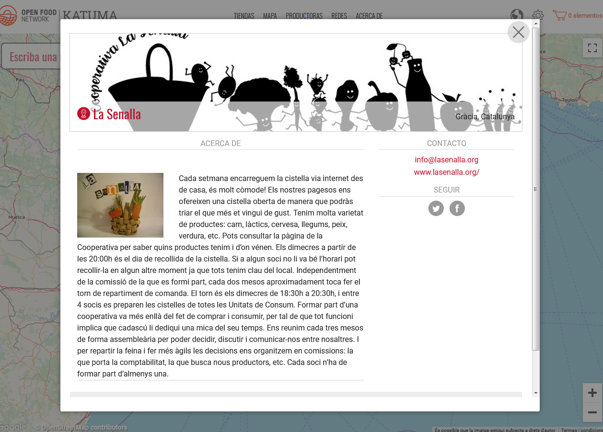
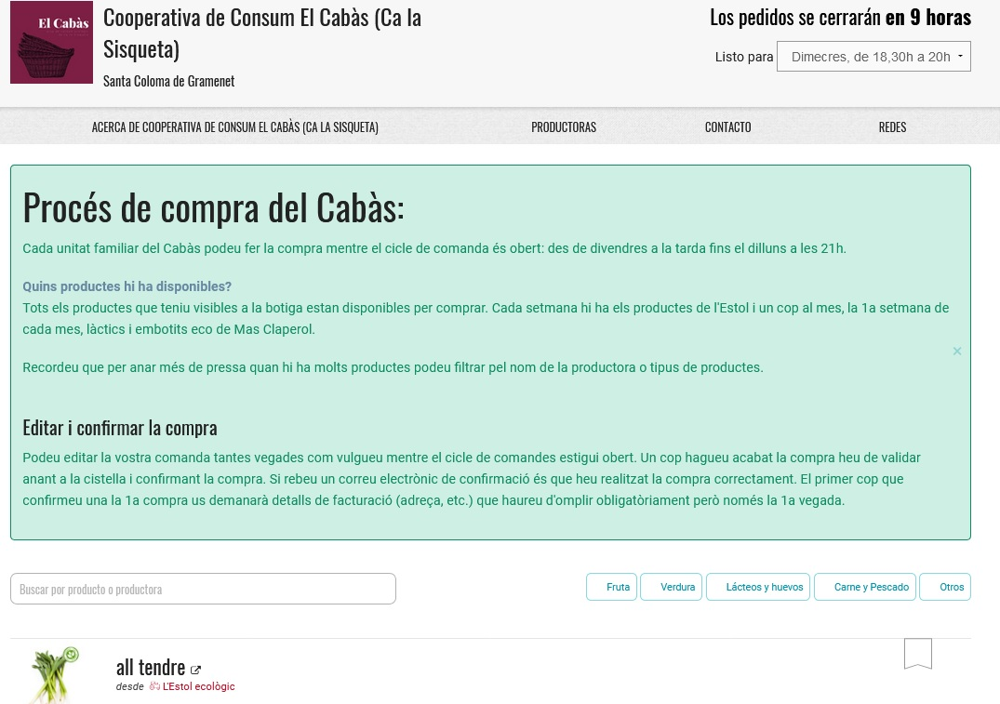
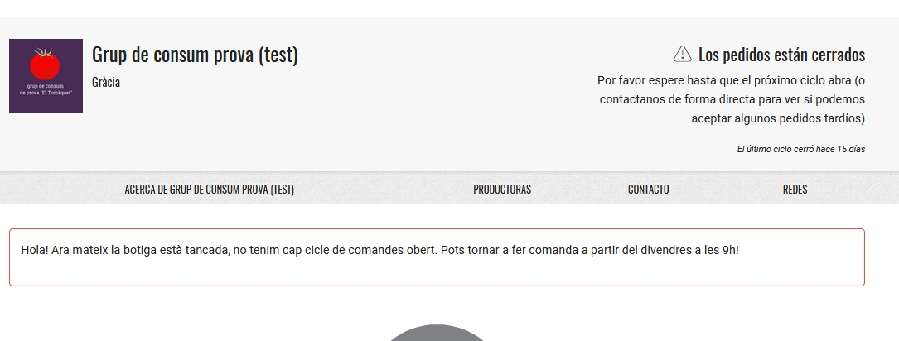

# Configuració de l'organització

### Accediu a la configuració d’organització 

1. Accediu al menú de l’administració a la part superior dreta, icona de l’engranatge.
2. Feu clic a "**Organitzacions**" al menú horitzontal blau.
3. Feu clic a "**Gestionar**".

Això us portarà a la vostra pàgina de perfil, on podreu emplenar informació bàsica sobre la vostra organització. Recordeu fer clic a “actualitzar” perquè es registri cada canvi que realitzeu.

### Detalls principals 

**Nom**: aquest és el nom de la vostra empresa, granja, etc. Serà el títol del vostre perfil i botiga.

**Productora principal**: seleccioneu “productor” si sou productors d'aliments. Si sou una organització implicada en el moviment alimentari però no produïu aliments, no seleccioneu la casella \(p. ex: un grup de consum, una cooperativa, un grup de compra, etc.\)

_\*Nota: només les organitzacions catalogades com a "productores" poden afegir productes propis a Katuma. Els grups de consum només han d'escollir aquesta opció en el cas que preparin i venguin, per exemple, capses amb productes de diverses productores que elles empaqueten o casos similars._

**Visible en la cerca**: seleccioneu “visible” si el vostre perfil ja està preparat per ser públic. Això farà que sigui visible al directori i mapa d'Open Food Network. Si continueu fent ajustos i no voleu que sigui públic, seleccioneu l’opció “no visible” fins que acabeu.

**Enllaç permanent \(sense espais\)**: podeu personalitzar una part de l’adreça web que acollirà la vostra botiga.

**Enllaç a la botiga**: aquesta és l’adreça web de la vostra botiga online a Katuma, si heu escollit un tipus de perfil amb botiga. Podeu personalitzar-lo. Us donarà una vista prèvia de com es veu el perfil.

### Adreça

 Aquesta informació s'utilitzarà per mapar la vostra organització al mapa d'Open Food Network. La vostra adreça exacta no mostrarà si tens només un perfil a Katuma; en canvi, si hi tens un perfil amb botiga es mostrarà un text en una fitxa amb detalls de contacte. 

### Contacte

**Nom de contacte**: sol·licitem un nom de contacte per als registres de Katuma. Aquest nom no es mostrarà públicament, però l'incloem en les confirmacions de la comanda si tens un perfil amb botiga.

**Correu electrònic, telèfon i lloc web**: aquestes dades es mostraran al vostre perfil i botiga de Katuma com a mitjà perquè altres contactin amb vosaltres

### Social

Proporcioneu els vostres detalls de xarxes socials les quals es vincularan al vostre perfil. \(escriviu l’enllaç complet per a Facebook, Linkedin i només el nom d’usuari per a Twitter i Instagram\).

### Sobre nosaltres

**Breu descripció**: apareixerà quan el perfil es visualitzi a la llista. 1 o 2 frases curtes que resumeixin el que feu.

**Sobre nosaltres**: descripció més llarga de la vostra organització. Es mostrarà quan el perfil es visualitzi íntegrament.

### Detalls del negoci

**NIF**: no es mostrarà públicament. És necessari per aquells usuaris que vulguin imprimir factures.

**Recàrrec d’IVA**: Si voleu carregar l’IVA als vostres productes, seleccioneu “sí”.

Podeu activar l’opció que el logo i una frase personalitzada apareguin a les factures.

### Imatges

**Logotip**: es veurà quan el vostre perfil es visualitzi com a finestra emergent. També es mostrarà al vostre perfil.

**Image promocional**: la imatge s'executarà horitzontalment a la part superior de la pàgina del vostre perfil. Ha de tenir una mida de 1200 x 260 píxels o es retallarà en aquesta mida.

A continuació teniu una imatge d'exemple de com es mostra un perfil:

### Propietats \(només visible per a productores\)

Podeu aplicar propietats \(com ara segell CCPAE, ous de gallines de pastura lliure, o certificat orgànic\) a la vostra organització. Aquestes propietats s'aplicaran automàticament a tots els vostres productes. Per a una discussió en profunditat sobre les propietats, feu clic _aquí_.

### Mètodes de pagament


Heu de crear un mètode de pagament abans de poder obrir una botiga en línia.


_\*els mètodes d'enviament i els de pagament només són visibles per als usuaris que hagin optat per tenir una botiga en línia_

Els _Mètodes d'enviament_, els _Mètodes de pagament_ i les _Comissions de l’organització_ estan tractades amb més detall en els capítols posteriors d'aquesta guia d'usuari.

### Configuració de l'inventari

_\*no és visible per a usuaris amb només perfil, sense botiga en línia_

Els usuaris bàsics poden utilitzar la configuració recomanada. Els usuaris avançats que necessitin una major flexibilitat en la gestió del producte, hauran de consultar la pàgina d'_Inventari_ d'aquesta guia abans de canviar la configuració. 

### Regles de les etiquetes

_\*no és visible per a usuaris amb només perfil, sense botiga en línia_

Podeu personalitzar la configuració de les etiquetes dels clients creant regles d'etiquetes. Per obtenir més informació sobre això consulteu _Etiquetes i regles d’etiquetes_.

### Configuració de la botiga

\*no és visible per a usuaris amb només perfil, sense botiga en línia

**Missatge de la botiga**: aquest missatge és opcional. Es mostrarà a la part superior de la vostra botiga en línia, per sobre del llistat de productes. És una oportunitat per proporcionar informació bàsica al client sobre com funciona la vostra botiga. Per exemple, podeu explicar com s'estructuren els cicles de les comandes o els requisits de pertinença. També podria ser una salutació amistosa o un text per promocionar ofertes. Un exemple és el següent:

**Missatge de botiga tancada**: aquest missatge es mostrarà quan la vostra botiga estigui tancada \(no hi ha cap cicle actiu\). És una oportunitat per informar els clients sobre com poden fer-vos encàrrecs i quan la botiga es veurà oberta i podreu acceptar comandes.

**Ordre de les categories de la botiga \(de dalt a baix\)**: els productes de la vostra botiga estan ordenats alfabèticament, dins de la seva categoria de producte. Podeu ordenar les categories de productes tal com voleu que apareguin, de dalt a baix, a la vostra botiga. Per exemple. si voleu que apareguin primer els productes frescos, a sota les conserves o qualsevol altre exemple.

**Ordeneu els cicles de comanda a la botiga per**: si la vostra organització tindrà _més d'un cicle de comanda obert al mateix temps_, podeu seleccionar l'ordre en què apareixen a la botiga. Podeu ordenar-los per data de tancament \(els que tanquen abans primer\) o per data d'obertura \(els que obren abans primer\).

**Visibilitat de la botiga?**: Si seleccioneu "pública", qualsevol consumidora que accedeixi a Katuma podrà veure la vostra botiga. Si seleccioneu "visible només per a consumidores registrades", als compradors que arribin a la vostra botiga se'ls demanarà que iniciïn sessió i només els usuaris que es trobin a la vostra llista de clients tindran accés a la vostra botiga.

**Comandes de convidats?**: Si seleccioneu "permetre comanda de convidats", els compradors no hauran d'iniciar sessió a Katuma per comprar a la vostra botiga. Si voleu que els compradors iniciïn la sessió abans que puguin realitzar la comanda, seleccioneu "s'ha de fer login per realitzar una comanda". Tingueu en compte que la configuració “permetre comanda de convidats” no és aplicable si heu triat “visible només per a consumidores registrades” a la configuració anterior.

**Canvia les comandes**: de manera predeterminada, la vostra botiga es configurarà com "les comandes realitzades no es poden cancel·lar". Això significa que després que un client hagi fet una comanda a la vostra botiga, no hi podran fer canvis, ni cancel·lar-la, sense contactar-vos i sol·licitar-ho. Si seleccioneu "Els clients poden canviar o cancel·lar comandes mentre el cicle de comandes està obert", els clients podran fer canvis fins que es tanqui el cicle. Poden fer això en el seu compte, fent clic a la comanda que volen canviar. Només poden canviar quantitats d'articles a la seva comanda, o cancel·lar-la. Per afegir elements nous a la comanda n’hauran de fer una de nova. Els clients que entren com a convidats no poden veure ni editar les seves comandes.

### Usuàries

\*_els següents camps només són visibles per als usuaris que hagin optat per tenir una botiga en línia._ 

**Propietària**: Aquesta és l'usuària principal responsable d'aquesta organització. Té el poder de canviar tots els aspectes del perfil.

**Notificacions**: aquesta és l'adreça de correu electrònic on es dirigiran les notificacions del sistema, és a dir, les confirmacions de comandes, etc. Si aquest correu electrònic difereix del vostre correu electrònic d'inici de sessió, haureu de confirmar l'adreça de correu electrònic. Aquest usuari tindrà un símbol al costat del seu nom al camp “Gestors”.

**Gestors**: altres usuaris de Katuma que han rebut el permís per administrar aquest compte. Voleu afegir un gestor nou? Podeu cercar correus electrònics existents d'usuaris que hagin registrat un compte a Katuma i afegir-los com a gestors.

**Convidar administrador**: això és per afegir un administrador que no està registrat a Katuma. Quan l’afegiu, se’ls enviarà una confirmació per correu electrònic i quan confirmin el seu correu electrònic podran configurar una contrasenya i iniciar sessió per administrar organització.

Un cop hagueu acabat torneu al Panell d’inici, fent clic a “panell” a la part superior de la pàgina.

