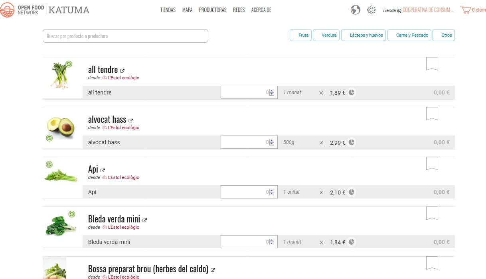
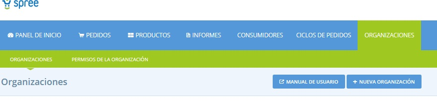

# Creeu o connecteu-vos amb les vostres productores proveïdores


Aquest apartat només és rellevant per als usuaris que no són productores o productores que volen vendre productes que provenen d'altres productores a la seva botiga.


Per a aquests usuaris, aquest pas és el pas previ necessari per afegir la gamma de productes a la botiga.  

Tots els productes de les botigues de Katuma han de "pertànyer" a un perfil de productora a Katuma. Aquesta és una característica important, ja que permet a les consumidores traçar l'origen dels productes. A continuació es mostra un exemple de com es mostra a la botiga.

Així que com a grup, què heu de fer abans d'afegir els vostres productes? Hi ha dues possibilitats, depenent de si la vostra productora proveïdora ja té o no un perfil a Katuma.  

Com sabeu si la productora proveïdora té un perfil a Katuma? Aneu a [aquesta llista](https://app.katuma.org/producers#/) i cerqueu-los.

### 1\) La productora proveïdora no té un perfil a Katuma

Si una productora no té un perfil a Katuma, podeu crear-ne un en nom seu. Sereu el "propietari" d'aquest perfil i podreu afegir els productes de la productora i emmagatzemar-los a la vostra botiga. La productora estarà visible al panell d’inici quan accediu al vostre compte existent. Si la productora algun cop vol prendre la propietat del seu perfil aquesta _es pot transferir fàcilment_.

#### Coses que cal considerar abans de crear un perfil d'una productora 

Abans de crear un perfil per a les productores proveïdores haureu de contactar-les i fer-los saber que esteu creant un perfil per a elles a Katuma. Potser vulguin participar en el procés i fins i tot assumir la responsabilitat de gestionar el perfil i els seus productes.  

Assegureu-vos de preguntar-li a la productora quina informació vol compartir al perfil. Sovint podeu agafar text i imatges dels seus llocs web o xarxes socials existents, però sempre haureu de demanar permís abans d'utilitzar qualsevol dels seus continguts. Una vegada tingueu la seva informació al davant, un perfil es crea en menys de 10 minuts.


Abans de poder crear un perfil de productora, us heu de posar en contacte amb nosaltres. Aquest és un mètode de prevenció de correu brossa, però una vegada que sabem que no sou un robot, us donarem permís per crear perfils d'organitzacions addicionals. Detalls de contacte: info@katuma.org


#### Crear un perfil de productora:

Podeu crear un nou perfil per a una productora fent clic a **Organitzacions** al menú blau horitzontal i, a continuació, al botó **+ Nova Organització**. Recordeu que “organització” és un terme general utilitzat per a qualsevol productora o grup a Katuma.  

Això us portarà als mateixos camps que hem vist a la secció 'Configuració de l'organització' d'aquesta guia. Algunes coses a destacar:  

**Nom**: introduïu el nom de la productora. Si obteniu un missatge d'error que indica que aquest nom ja existeix, significa que ja hi ha un perfil per a aquesta productora. Per tant, podeu saltar a l'opció 2 següent \(_La productora proveïdora ja té un perfil preexistent a Katuma_\).

**Productora principal**: seleccioneu aquesta casella, ja que afegiu una productora proveïdora.

**Visible a la cerca**: haureu d‘acordar amb la productora si vol o no ser visible a Katuma. Si vol ser invisible, el seu nom i perfil es mostraran al costat dels seus productes a la vostra botiga, però no es podran cercar al mapa ni als directoris de la pàgina principal.

**Correu electrònic i telèfon**: aquest correu electrònic i el número de telèfon estaran visibles al perfil. Si aquest productor no vol ser contactat pel públic, poseu aquí les dades de contacte del vostre grup.

**Sobre nosaltres**: recordeu que Katuma té a veure amb la transparència en el sistema alimentari i les consumidores cada cop estan més interessades en el lloc d’on provenen els seus aliments. Per tant, val la pena afegir molts detalls sobre les productores i el que les fa úniques.

**Imatges**: Us recomanem que tots els perfils tinguin imatges de logo i promocional. Aquestes imatges fan que l'experiència en línia de les consumidores sigui més agradable i atractiva i que aporti credibilitat a les organitzacions.

### 2\) La productora proveïdora ja té perfil preexistent a Katuma

Si una productora proveïdora ja té un perfil a Katuma, haureu de rebre el seu permís per afegir productes al seu perfil \(si encara no en té\) i que apareguin a la vostra botiga. Podreu trobar les seves dades de contacte al seu perfil de Katuma. Tingueu en compte que el perfil de la productora podria ser gestionat per un altre grup, però això no és un problema: Katuma pot allotjar dos grups que contenen els productes de la mateixa productora en botigues separades.  

Dins de Katuma, els _Permisos entre organitzacions \(E2E\)_ s'utilitzen per controlar la naturalesa dels acords comercials entre productores i grups. Les productores poden concedir als grups diferents tipus de permisos E2E, en diferents combinacions, per especificar exactament amb quins elements del seu compte el grup pot interactuar. En el nivell més senzill, un productor pot concedir al grup permís per penjar els seus productes a la seva botiga. També els pot interessar permetre que el grup creï o modifiqui els seus productes o editi el seu perfil.  

_Aquesta pàgina_ abasta tots els detalls dels diferents permisos E2E disponibles. Parleu amb la productora sobre els permisos que necessiteu. Per obtenir informació sobre com el productor pot atorgar els permisos E2E, consulteu _aquí_.

