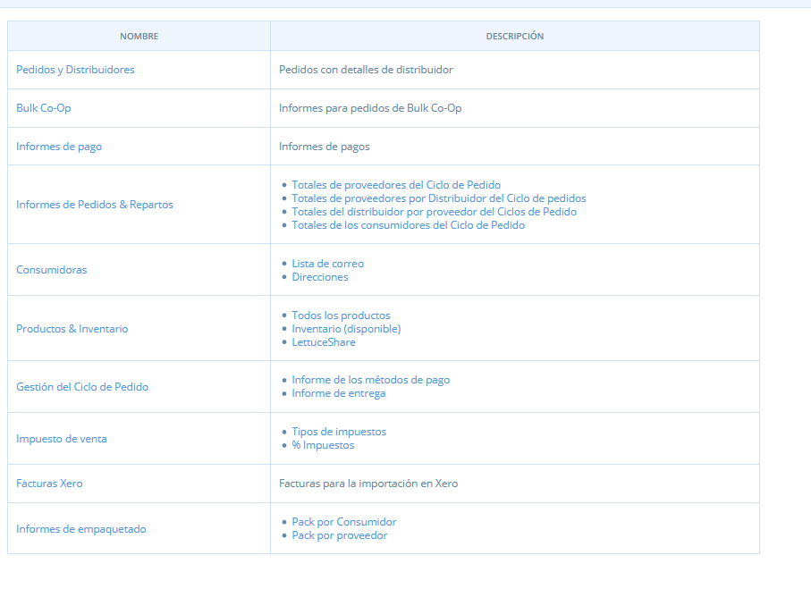
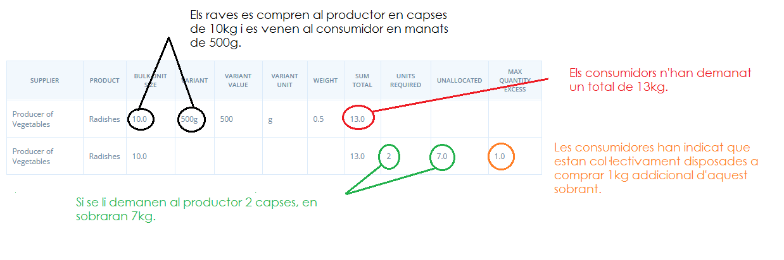
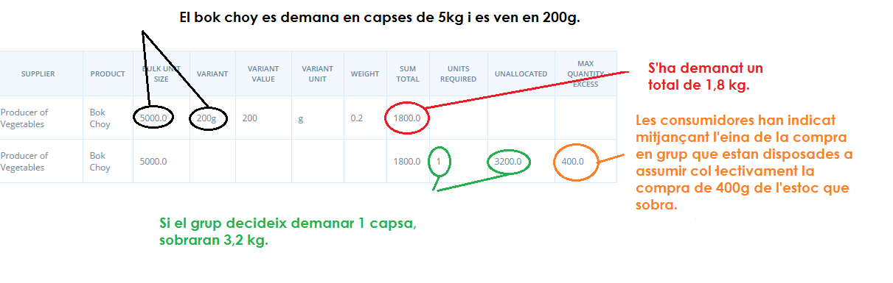

# Informes

Accediu als informes fent clic a **Informes** en el menú horitzontal.

Això us portarà a una taula que inclou tots els informes disponibles.

Els dos informes més útils i d'ús general són el **Total de proveïdors del cicle de comandes** i els **Totals de consumidors del cicle de comandes**. Si teniu previst atendre les vostres comandes de forma individual, l'informe **Total de consumidors del cicle de comandes** us serà més rellevant. Si teniu intenció de realitzar comandes en lots corresponents a un cicle de comandes, també us serà útil el **Total de proveïdors de cicles de comandes**. Els informes de **Llista de correu** i **Adreces** també són útils per gestionar els detalls dels vostres clients. L'informe **% d’impostos** és útil per a les organitzacions que treballen amb informes amb IVA. Finalment, l'informe **Bulk Co-op \(comandes en bloc\)** ajuda a la presa de decisions de comandes en grup, en bloc.

## Total de consumidors del cicle de comandes

A la imatge següent es mostra la informació continguda en un informe de **Totals de consumidors del cicle de comandes**. Aquest informe es pot generar per reflectir un determinat cicle de comanda seleccionant un cicle de comandes al menú desplegable. Com podeu veure, també podeu seleccionar descarregar una còpia CSV d'aquest informe \(un fitxer Excel\). L'informe mostra la comanda de cada client, inclòs el seu correu electrònic i les dades de contacte, el producte que ha demanat, l'import, l'article \(€\) i el total. Finalment, també mostra el mètode d'enviament que ha seleccionat. Si ateneu les comandes de manera individual, aquest informe us proporciona tota la informació per empaquetar la comanda, posar-vos en contacte amb el client i organitzar-vos per a repartir o per a la recollida. Si esteu preparant comandes en bloc al tancament d'un cicle de comandes, aquest informe es pot utilitzar per guiar el vostre empaquetatge i entrega.

## Total de proveïdors del cicle de comandes

La imatge següent mostra la informació continguda en un informe de **Totals del proveïdor del cicles de comandes**. Igual que l'informe anterior, aquest informe també es pot generar per reflectir un determinat cicle de comanda seleccionant un cicle de comandes al menú desplegable. Com podeu veure, també podeu seleccionar descarregar una còpia CSV d'aquest informe \(un fitxer Excel\). A l'informe, el proveïdor apareix a la part esquerra. A continuació es detallen tots els productes i les seves variants, i la quantitat de cadascun que es ven. Al tancament d'un cicle de comandes, aquest informe us mostra clarament la quantitat de cada producte que necessiteu per tal d'empaquetar correctament les comandes.

## Llista de correu

L'informe de la **Llista de correu** mostra els noms i les adreces de correu electrònic dels clients que han realitzat comandes a la vostra botiga. Podeu filtrar l'informe segons el cicle de comandes, que us permetrà alertar als clients si hi ha algun producte esgotat o canvis en la data de lliurament, per exemple. Vegeu-ne un exemple a continuació. Igual que amb tots els informes, la llista es pot descarregar com a fitxer CSV.

## Adreces

L'informe **Adreces** informa dels noms dels clients, les adreces, els correus electrònics, els números de telèfon i el grup o botiga a través del qual han comprat. De nou, aquest informe es pot filtrar mitjançant un cicle de comandes.

## Productes & Inventari

Els informes **Tots els productes** i els **Inventari \(disponible\)** es poden utilitzar com una còpia en paper d’un full de comanda, per si algun client que prefereix demanar en paper. Enumera tots els vostres productes i els seus preus \(vegeu més avall\). L’informe de **Tots els productes** enumera tots els vostres productes, independentment de si tenen quantitats per sobre de zero. L'informe **Inventari \(disponibles\)** mostra només productes que tenen una disponibilitat amb valor positiu \(més de zero\).

## Informes d'embalatge

Algunes empreses utilitzen els correus electrònics de confirmació de comanda com a fulls d'empaquetatge, i altres creen els seus propis modificant l'informe del **Total de consumidors del cicle de comandes** \(vegeu més amunt\) per adaptar-los al seu format desitjat. Aquests informes d'embalatge ofereixen dues opcions addicionals per a embalatges.

#### Paquet per client

Aquest informe enumera cada consumidora que ha fet una comanda. Inclou cada article demanat per les consumidores, juntament amb la quantitat demanada. És útil per a botigues que serveixen les comandes en cistelles o paquets client per client.

#### Paquet per proveïdor

Aquest informe enumera cada proveïdor i els seus productes. Al costat de cada producte hi ha el nom dels clients que han demanat aquest producte i la quantitat que han demanat. Aquest informe és útil per a botigues que envien comandes segons el proveïdor.

## Impostos de venda

Aquest informe és útil per separar el component fiscal de vendes, lliurament i comissions.

## Factures Xero


Xero és un programari de gestió empresaria, de facturació i comptabilitat australià. En algunes instàncies d'Open Food Network es fa ús d'aquest informe donat que s'usa aquest programa integrat a Open Food Network.


## Informe Bulk Co-Op \(comandes en grup o a l'engròs\)

Aquest informe informa als administradors de vendes si han arribat al llindar de comandes a l'engròs o grupals i quant han excedit o han sobrepassat aquesta quantitat. Tingueu en compte que heu de configurar les mides dels vostres productes abans d'utilitzar aquesta característica, consulteu a les funcions avançades **Compres en grup** per obtenir instruccions.

Quan es tanqui el cicle de comandes, aquest informe pot ajudar la botiga a respondre les següents preguntes:

* Les consumidores han demanat prou d'aquest producte per justificar la comanda de compra conjunta del proveïdor?
* Si l'eina de **Compres en grup** està habilitada, quina quantitat de productes addicionals haurien de demanar els meus clients per ajudar el grup a assolir el llindar mínim de compra en grup?
* Quantes compres mínimes s’haurien de demanar per satisfer la demanda de les consumidores?
* Si la botiga demana la mida mínima, quina quantitat d'existències es deixarà? O, dit d’una altra manera, quants clients estaran decebuts si aquest producte s’acaba no demanant?

Vegeu l'exemple següent per obtenir una il·lustració sobre com es pot utilitzar aquest informe. Aquest és un exemple d'on s'ha arribat a la quantitat de comanda mínima en grup:

Aquest és un exemple on no s'ha assolit la quantitat de comandes mínima en grup:

_Tingueu en compte que l'informe de "Bulk Co-op - Assignació" és similar a aquest informe, però mostra la comanda de cada consumidora individualment, en lloc del total acumulatiu de totes les consumidores._  

  

