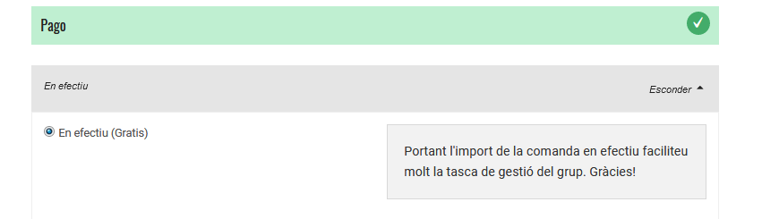
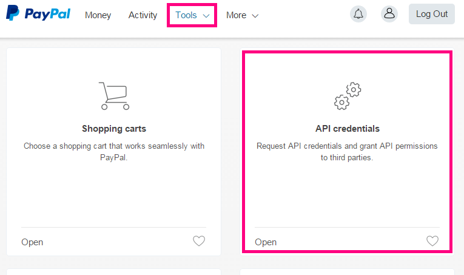
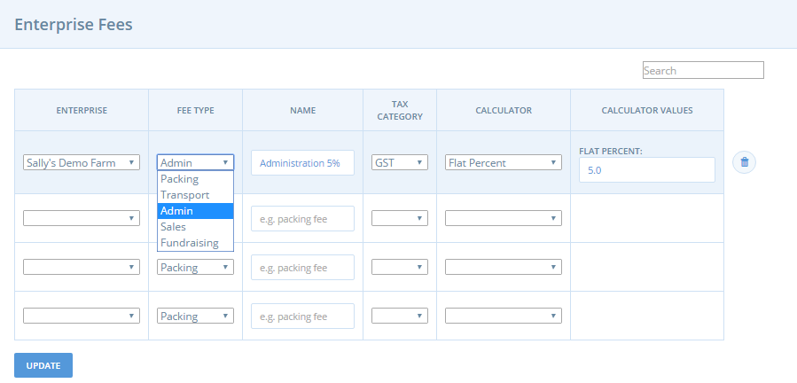
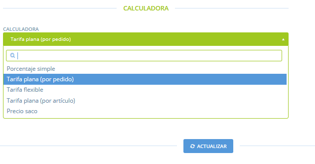

# Mètodes de pagament


Heu de crear un mètode de pagament abans de poder obrir una botiga en línia.


## Creació d'un mètode de pagament

1\) Aneu a la pàgina de mètodes de pagament: feu clic **Organitzacions** al menú horitzontal blau i llavors clic a **Gestionar** al costat de la seva organització. A continuació, feu clic a **Mètodes de pagament** del menú esquerre.  

2\) Feu clic a **Crear un nou mètode de pagament**.  

3\) Marca la teva organització a la casella de la part dreta de la pàgina. Això indica a quina organització s'aplicarà el mètode de pagament que esteu a punt de crear. Podeu seleccionar més d'una organització si és el cas.  

4\) **Nom**: trieu un nom per a aquest mètode de pagament \(per exemple: pagar amb targeta de crèdit per Paypal, contrareembossament, en efectiu, transferència bancària\). Es mostrarà durant el procés de realització de la comanda i al correu electrònic de confirmació de comanda.  

5\) **Descripció**: aportar més detalls sobre la forma de pagament. Per exemple, si és via transferència bancària, li proporcionaria detalls del compte bancari. Aquesta descripció es mostrarà durant el procés de realització de la comanda i al correu electrònic de confirmació de comanda.  

La següent imatge mostra un mètode de pagament. El client ha seleccionat l’opció de pagar en el moment de recollida o entrega de la comanda i es mostra la descripció “portant l'import de la comanda en efectiu faciliteu molt la tasca de gestió del grup. Gràcies!”:

6\) **Actiu**: Seleccioneu si aquest mètode de pagament és actualment visible i disponible, o no.  

7\) **Tags \(etiquetes\)**: utilitzeu regles d'etiquetes si voleu fer certs mètodes de pagament disponibles o no disponibles per als clients específics \(per exemple, clients a l’engròs vs. venda al detall, o grups de consum vs. cistelles individuals\). Vegeu _Etiquetes i regles d'etiquetes_ per obtenir més informació.  

8\) **Proveïdors de pagament**: seleccionar el que és rellevant per a la modalitat de pagament que esteu creant.

Es pot acceptar el pagament mitjançant 5 opcions:

* Cash \(efectiu\)/EFT/etc. \(trieu aquesta opció per a pagaments que es produeixen després de la confirmació de la compra, externament a Katuma, per exemple si pagueu en efectiu o per transferència bancària\)
* Mastercard Internet Gateway servei \(MIGS\)
* PayPal Express
* Stripe 
* Banda de pagaments de PIN

Si heu seleccionat ' cash/EFT/etc.' com a opció, feu clic a **Crea** per finalitzar el procés.

### Proveïdors de pagament

Sota teniu les instruccions addicionals de pagament amb MasterCard, Paypal, Stripe i Pin:



Per a configurar un mètode de pagament PayPal, necessita un compte de PayPal. Podeu crear-ne un [aquí](https://www.paypal.com/au/webapps/mpp/merchant). Una vegada el tingueu, podeu configurar l 'Accés API' dins de PayPal, que permetrà Katuma connectar clients directament amb el vostre compte de PayPal.  

1. Accedeix al teu compte PayPal
2. Feu clic a eines i llavors seleccionar les credencials d'API

1. Feu clic a ‘Visualitza la signatura d'API’ i podreu veure els detalls d'API que necessitareu per configurar Paypal a Katuma.

A Katuma, assegureu-vos que estigueu connectats amb el seu usuari d'empresa o organització i no personal. Anar a **Organitzacions** i crear un mètode de pagament. Seleccioneu PayPal i ompliu les dades del vostre compte de PayPal.

**Inici de sessió**: el nom d'usuari d'API.  
**Contrassenya**: la contrasenya d'API.  
**Signatura**: la signatura en aquest camp.

**Servidor**: Canviar el camp "servidor" per "live"- distingeix entre minúscules i majúscules.  

**Solution**: determina si un usuari necessita un compte de PayPal o no. Escriviu "Mark" si voleu que els usuaris hagin de tenir un compte de paypal, o "Sole" si poden pagar sense un compte de Paypal \(amb targeta de crèdit\).  

**Landing page**: Podeu seleccionar quina pàgina se’ls mostrarà als clients una vegada que se'ls redirigeixi a PayPal. Escriviu "Login" per dirigir al client al formulari d'accés a PayPal \(si heu seleccionat "Mark" anteriorment\). O escriviu"Billing" per mostrar els clients un formulari on poden entrar les seves dades de targeta de crèdit i la possibilitat de donar d’alta un compte de PayPal \(si heu seleccionat "Sole" anteriorment\).



Per utilitzar aquest servei s'ha de fer a través del vostre banc.



​[Stripe](https://stripe.com/au) és una plataforma de pagament online similar a PayPal. Us permetrà acceptar pagaments amb targeta de crèdit de les vostres consumidores. Stripe és una plataforma local però només està disponible en certes instàncies d'Open Food Network. Contacta amb l'equip local d'OFN, Katuma, per saber si aquesta possibilitat està disponible.

#### Per què utilitzem Stripe? 

Stripe és senzill de configurar per a qui tingui botiga a la paltafora i té unes tarifes raonables. Els recàrrecs d'Stripe varien a casa país; [Australia](https://stripe.com/au/pricing), [Canada](https://stripe.com/ca/pricing), [France](https://stripe.com/fr/pricing), [UK](https://stripe.com/gb/pricing), [USA](https://stripe.com/us/pricing).

Stripe també és fàcil d'utilitzar per a les consumidores. A diferència de PayPal, quan el client valida la compra, no necessita iniciar sessió amb PayPal per fer la comanda, sinó que només han d'introduir les dades de la seva targeta i, a continuació, completar la seva comanda.

Stripe és el mètode de pagament recomanat per a les botigues que desitgen utilitzar **subscripcions** a Open Food Network, ja que permet que les consumidores donin permisos a una botiga perquè automàticament facturin la seva targeta de crèti per a les comandes de subcripcions. Aquesta opció no s'ofereix a les plataformes de pagament Paypal, Pin or MIGS.

#### Configuració

**Connecta't amb Stripe**

Abans que pugueu configurar un mètode de pagament per Stripe us hi haureu de connectar. Per fer-ho, feu clic al botó 'Connect whit Stripe'.

El botó us portarà a un formulari per omplir amb els vostres detalls. Si ja teniu un compte a Stripe, podeu iniciar la sessió i, si no, ompliu les dades per crear-vos-en un. 

La informació per la qual us demanaran inclou: país, una descripció del vostre negoci, l'adreça i NIF, les vostres dades personals i el vostre compte bancari \(on rebreu els pagaments\).

**Creeu un nou mètode de pagament**

Una vegada esteu connectades amb Stripe podeu crear un mètode de pagament que funcionarà amb el compte que heu connectat.

Tracteu les caselles del **Nom**, **Descripció**, **Actiu** i **Etiquetes** com faríeu en qualsevol altre mètode de pagament.

**Provider:** seleccioneu Stripe.

Una vegada heu seleccionat Stripe, se us mostraran les 'Configuracions del proveïdor'.

**Propietari del compte d'Stripe:**

Selecciona l'empresa que té el compte de Stripe connectat.

Si has seleccionat una organització o empresa que no està connectada amb Stripe \(veure avall\), se't mostrarà un error a la part inferior. Feu clic a 'Connectar-ne una' o torneu a la vostra taula de Mètodes de Pagament per connectar-ne una. Vegeu les instruccions més amunt.

#### Pagaments per Stripe per a les consumidores

Quan les consumidores validin la compra i paguin amb Stripe com a mètode de pagament, tindran l'opció de seleccionar unes caselles per impedir l'emmagatzematge de les dades de les seves targetes de crèdit en contra de la seva voluntat.

Les consumidores també poden guardar una targeta de crèdit al seu compte o esborrar les que tinguin guardades.

Quan la consumidora fa una altra compra a una botiga d'Open Food Network que ofereix Stripe com a mètode de pagament podrà seleccionar les seves targetes de crèdit desades.

**Veure i bescanviar els pagaments per Stripe**

Quan una consumidora paga la seva comanda amb Stripe, els fons \(menys les tarifes de Stripe\) aniran al vostre compte de Stripe. Depenent de la vostra configuració d'Stripe els fons es transferiran automàticament de manera periòdica al vostre banc escollit. 

**Agafar altres pagaments**

Si necessites agafar un pagament addicional d'una consumidora perquè té un saldo a deure pots crear una factura a Stripe. La consumidora rebrà un correu electrònic demanant si la vol pagar amb targeta de crèdit o dèbit. Això no es comunicarà a Open Food Network, així que hauràs de marcar el pagament com a realitzar manualment.



Per a pagaments amb Pin només necessiteu la clau d'API. Haureu de configurar un compte a PinPayments en primer lloc i podeu obtenir un descompte per inscriure-us com a membre de Katuma \([https://pin.net.au/partners/open-food-network/signup](https://pin.net.au/partners/open-food-network/signup)\)

**API key**: entreu la vostra clau API en aquest camp. La podeu aconseguir en el vostre compte de PinPayments \(vegeu més avall\). En primer lloc des del vostre compte, seleccioneu “claus API”. Llavors una vegada que ha generat una clau d'API, copieu-lo i enganxeu-lo en el camp AP Key a Katuma.

**Servidor**: escriviu “live” en aquest camp. Distingeix entre majúscules i minúscules.



### Recàrrecs o taxes en els mètodes de pagament

Podeu aplicar un recàrrec al mètode de pagament. Més comunament això s'utilitza per passar els recàrrecs d’una plataforma al client, com ara la taxes Paypal.  
1. Seleccioneu la calculadora de recàrrecs \(descripció completa a sota\)  
2. Introduïu el valor.

_Nota: les taxes de mètode de pagament no inclouen impostos._

#### **Calculadora de recàrrecs**

**Percentatge simple**: aquest recàrrec s’aplica com a percentatge de __l'import total en la comanda.

**Tarifa plana \(per comanda\)**: aquest recàrrec s'aplica de manera estàndard a totes les comandes, independentment de la mida de la comanda.

**Tarifa flexible**: aquesta calculadora s'utilitza normalment per a descomptes promocionals on es cobra un recàrrec reduït com més compres fa el client.  

* 'recàrrec del primer element': els recàrrecs aplicats al primer element de la comanda.
* 'recàrrecs d’elements addicionals': els recàrrecs s’apliquen als elements a partir del primer element.
* "màxim elements": el nombre màxim d'elements sobre els quals s'aplicarà el recàrrec. Articles comprats a partir d'aquesta quantitat no se’ls aplicarà el recàrrec.

Per exemple: si el càrrec del primer element és 2€, el càrrec d’elements addicionals de l'article és d’1€ i s’ha fixat un ‘màxim d’elements’ de 3: si un client demana 5 articles, se li cobraran 2€ de càrrec pel primer article, 1€ pel segon i el tercer, i cap per al quart i el cinquè.  

**Tarifa plana \(per element\)**: aquest càrrec és una tarifa fixa, aplicada als productes que figuren com a “elements” \(no s'aplicarà als productes que es venen per kg o l\).  

**Preu sac**: aquest recàrrec s'utilitza per aplicar un descompte els recàrrecs per comandes que superen un determinat import en euros.  

* "Import mínim": si el total de la comanda és inferior a aquest import, se us cobrarà la l’”import normal”.
* "Quantitat de descompte": a les comandes que siguin iguals que o superiors a la quantitat mínima fixada se’ls aplicarà "Import amb descompte".

