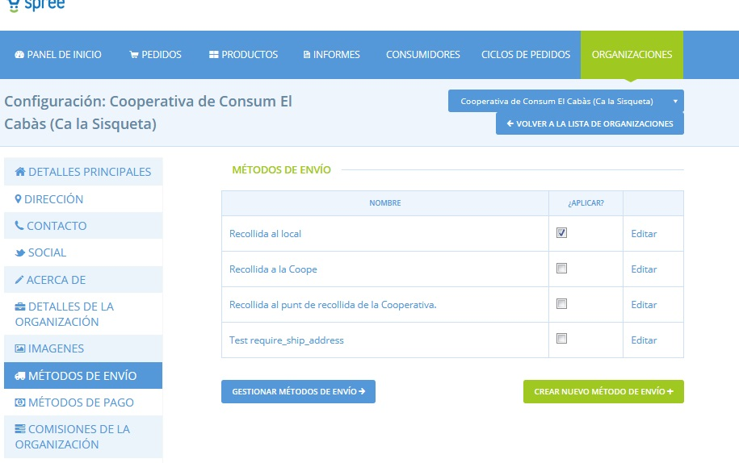
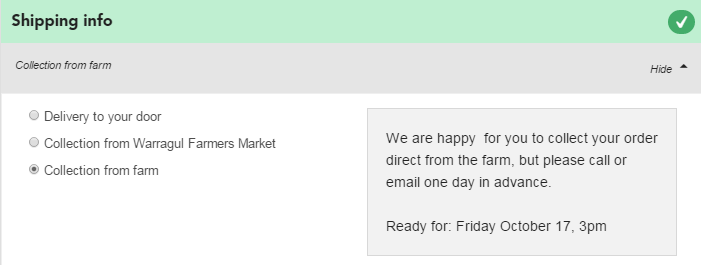

# Mètodes d'enviament


Has de crear un mètode d’enviament abans de poder obrir la teva botiga.


### Configuració d'un mètode d'enviament

1. Aneu a la pàgina de mètodes d'enviament: feu clic a **Organitzacions** al menú horitzontal blau i, a continuació, feu clic a **Gestionar** al costat dret de la vostra organització. A continuació, feu clic a **Mètodes d'enviament** al menú de l'esquerra.
2. Feu clic al botó **Crear un nou mètode d'enviament**.

3. Marqueu la vostra organització a la casella situada a la part dreta de la pàgina anomenada ‘Grups’. Això indica que el mètode d'enviament que voleu crear s'aplicarà a la vostra organització.

4. **Nom**: escolliu un nom per a aquest mètode d'enviament. \(per exemple: lliurament, recollida al mercat d’agricultors o servei postal\). Es mostrarà en el moment de realització de la comanda i en els correus electrònics de confirmació de comanda.

5. **Descripció**: aquí podeu proporcionar més detalls sobre el mètode d'enviament. Això serà visible per al client quan finalitzi la compra. Per exemple, la captura de pantalla següent mostra que quan aquest client selecciona "recollida a la granja", el quadre gris del costat dret mostra la descripció "Estem contents que reculli directament des de la granja però sisplau envïi un correu electrònic o truqui abans de venir". 

6. **Zona**: seleccioneu la zona adequada.  

7. **Categoria**: és aquest mètode un lliurament o recollida?  

8. **Etiquetes**: podeu fer que els mètodes d'enviament visibles o invisibles per a determinats clients mitjançant l'ús de les _Etiquetes i les regles d'etiquetes_.  

9. **Calculadora**: seleccioneu la forma en què s'aplicaran les despeses d'enviament a aquest mètode d'enviament. Tingueu en compte que la despesa d'enviament pot ser zero.

En fer clic a **Crear**, es crearà el mètode d'enviament i, a continuació, se us proporcionaran nous camps, per afegir-hi detalls dels càrrecs del mètode d'enviament. Els camps presentats dependran de quina calculadora de despeses d'enviament heu seleccionat. Tal com s'indica, si esteu canviant el tipus de calculadora, primer heu de guardar abans de poder editar la configuració de la calculadora.

### Calculadora de despeses d'enviament

**Pes \(per kg\) -** aquest recàrrec s'aplica als productes per kg i no als productes que es mostren com a elements, per exemple: un producte que figura com a "1 manat de julivert" no rebrà aquest recàrrec.  

**Percentatge simple -** aquest recàrrec s’aplica com a percentatge de l'import total de la comanda.  

**Tarifa plana \(per comanda\) -** aquest recàrrec s'aplica de manera estàndard a totes les comandes, independentment de la mida de la comanda.  

**Tarifa flexible -** aquesta calculadora s'utilitza normalment per a descomptes promocionals on es cobra un recàrrec reduït com més compres fa el client:

* 'recàrrec del primer element': els recàrrecs aplicats al primer element de la comanda.
* 'recàrrecs d’elements addicionals': els recàrrecs s’apliquen als elements a partir del primer element.
* 'màxim d'elements': el nombre màxim d'elements sobre els quals s'aplicarà el recàrrec. Articles comprats a partir d'aquesta quantitat no se’ls aplicarà el recàrrec.

Per exemple: si el càrrec del primer element és 2€, el càrrec d’elements addicionals de l'article és d’1€ i s’ha fixat un ‘màxim d’elements’ de 3: si un client demana 5 articles, se li cobraran 2€ de càrrec pel primer article, 1€ pel segon i el tercer, i cap per al quart i el cinquè.

**Tarifa plana \(per element\) -** aquest càrrec és una tarifa fixa, aplicada als productes que figuren com a “elements” \(no s'aplicarà als productes que es venen per kg o l\).

**Preu sac -** aquest recàrrec s'utilitza per aplicar un descompte els recàrrecs per comandes que superen un determinat import en euros:

* "Import mínim": si el total de la comanda és inferior a aquest import, se us cobrarà "l’import normal”.
* "Quantitat de descompte": a les comandes que siguin iguals que o superiors a la quantitat mínima fixada se’ls aplicarà "Import amb descompte".

Les despeses d’enviament són importants en situacions en què la productora o xarxa contracten a un tercer per realitzar el seu enviament. No obstant això, les despeses d'enviament poden ser zero. Per a les productores que venen directament als clients, el preu de l'enviament es pot incorporar al preu de la mercaderia. Tanmateix, si bé és possible que no necessiteu cobrar despeses d’enviament a clients que recullen les seves comandes, per al lliurament és raonable cobrar més.  

