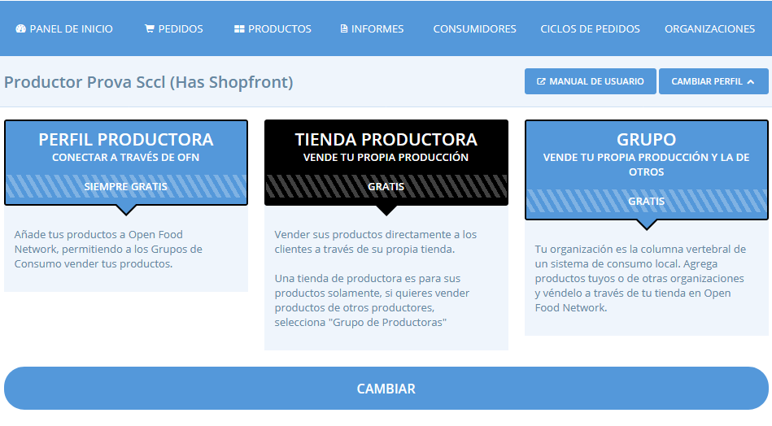
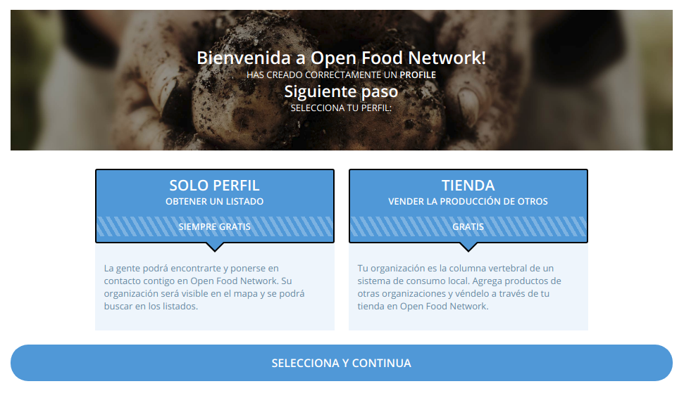

# Tipus de perfils

Hi ha cinc tipus de perfils diferents disponibles, cadascun d'ells diferent segons el tipus d'organització (productor o grup) i si tenen o no una botiga en línia associada amb el perfil. Quan creeu el vostre perfil i inicieu sessió per primera vegada se us demanarà que seleccioneu un tipus. La vostra selecció aquí determina la funcionalitat que tindrà el vostre perfil, és a dir, si tindreu un perfil o també una botiga en línia associada a aquest perfil. Els diferents tipus també poden tenir diferents estructures de tarifes, fet que depèn de cada instància d’Open Food Network i que en aquest cas determina l’assemblea de Katuma. A continuació, es detallen els diferents paquets per a productores i grups (no productores).

## Per a productores



Aquesta opció us permet crear un perfil a Katuma. El vostre perfil és una manera de compartir la vostra història amb els altres i fer-vos visibles i contactar amb clients i altres organitzacions que vulguin comerciar amb vosaltres. Un productor amb un perfil també pot afegir productes, que es poden emmagatzemar en altres botigues de Katuma.



Aquesta opció permet als productors crear la seva pròpia botiga a Katuma a través del qual poden vendre els seus productes. Tingueu en compte que els productors poden realitzar vendes a través de la seva pròpia botiga i, simultàniament, actuar com a proveïdor en una altra botiga.



Aquesta opció és per als productors que desitgen vendre els seus propis productes, així com els productes creats per altres productors.



## Per a no productores (grups de consum, etc.)



Aquesta opció us permet crear un perfil Katuma. El vostre perfil és una manera de compartir la vostra història amb els altres i fer-vos visible i contactar amb les consumidores i proveïdores que vulguin comerciar amb vosaltres.

Si només voleu un perfil a Katuma, un cop hàgiu creat el vostre compte, confirmeu el vostre correu electrònic i seleccioneu un tipus de perfil sense botiga, el vostre perfil s’haurà creat a Katuma i ja haureu acabat.



Aquesta opció us proporciona una botiga en línia completa per al vostre grup, a més del perfil.



### Canviar el tipus

Podeu canviar el tipus en qualsevol moment en el futur. Això es pot fer fent clic al botó "**Canvia el tipus**" del Panell d’inici. O bé, podeu canviar l'estat i el tipus del productor/no productor seleccionant “**Organitzacions**” al bloc horitzontal blau i, a continuació, editeu la configuració de l'organització \(vegeu més avall\).

