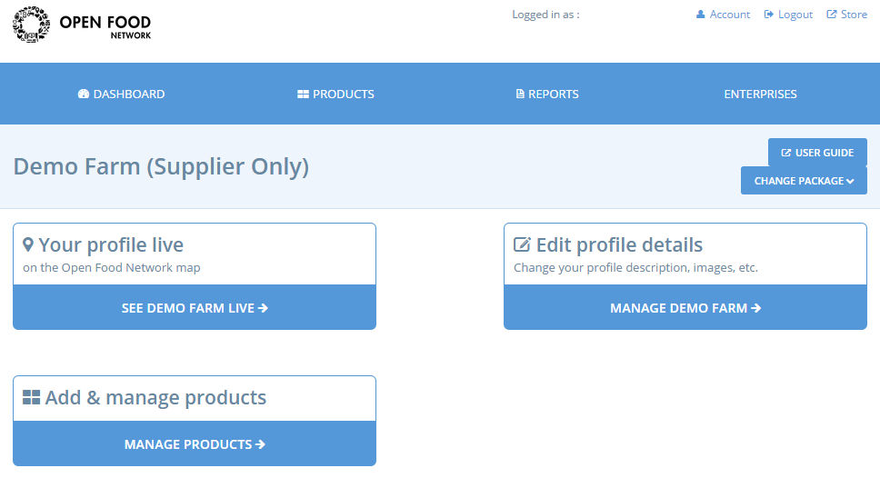
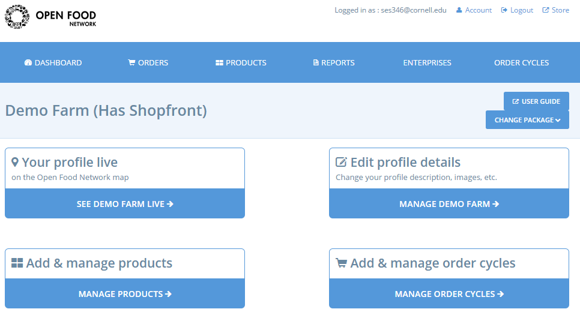
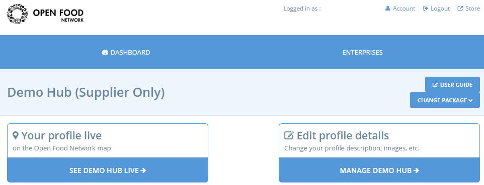
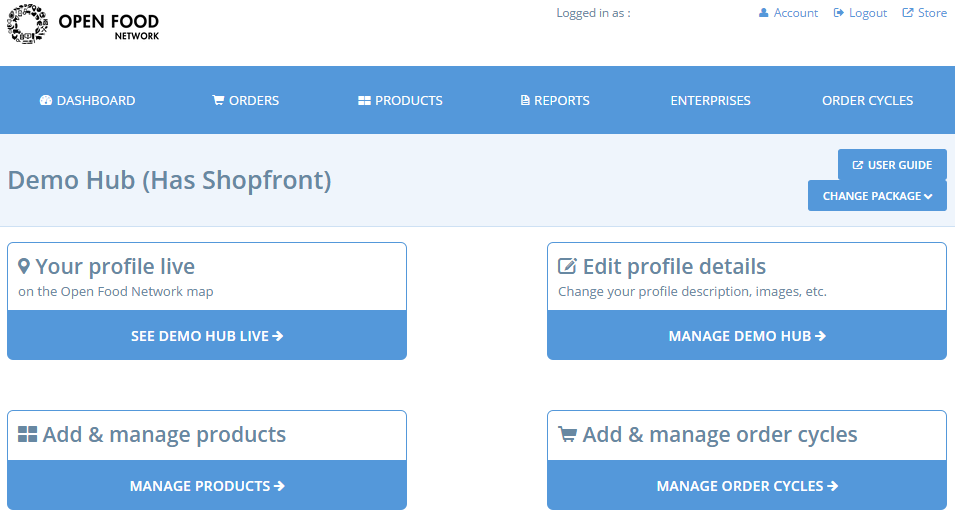

# Panell d'inici

El panell d'inici és el centre de control del vostre compte. Des del panell podeu gestionar el vostre perfil i tots els elements de la vostra botiga en línia.

Accediu al quadre de comandament des de la pàgina d'inici, primer feu clic a “**Iniciar sessió**” i, a continuació, feu clic a la icona de l’engranatge a l'extrem superior dret i seleccioneu "**Administració**" al menú desplegable.  

La següent captura de pantalla mostra la vista del panell d’inici per als diferents tipus de perfils:

### Productores











### Grups de consum











