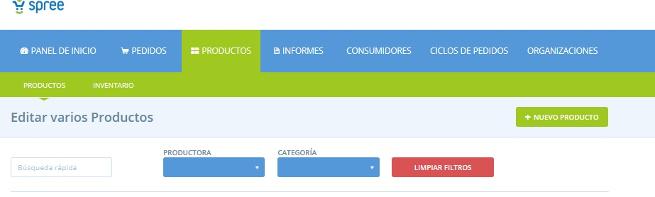
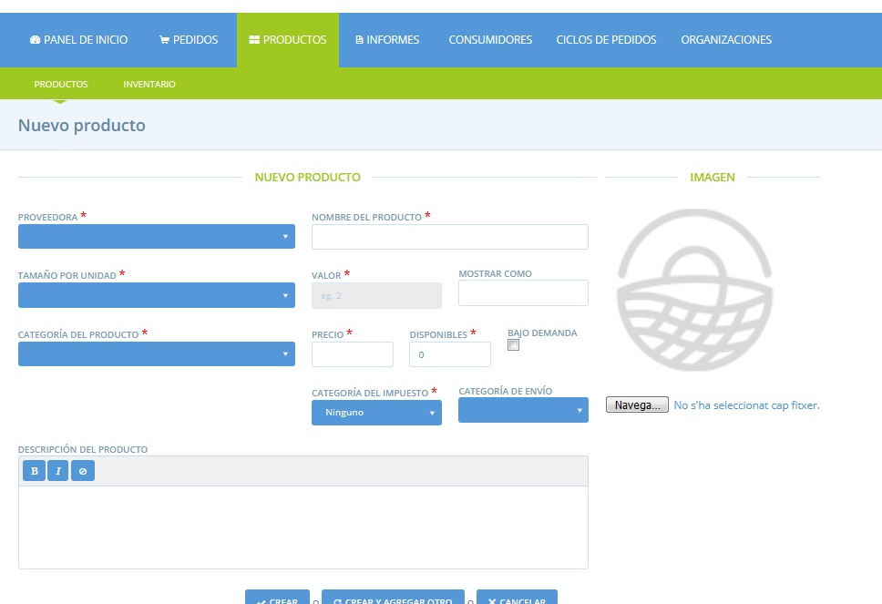
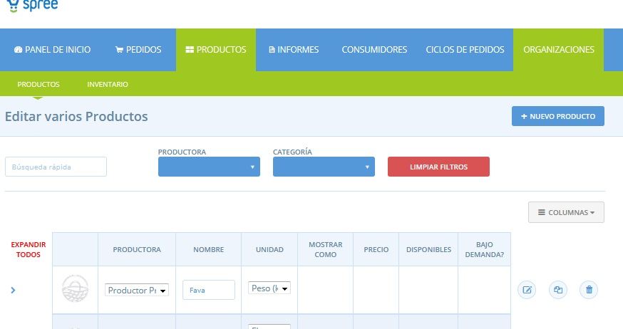
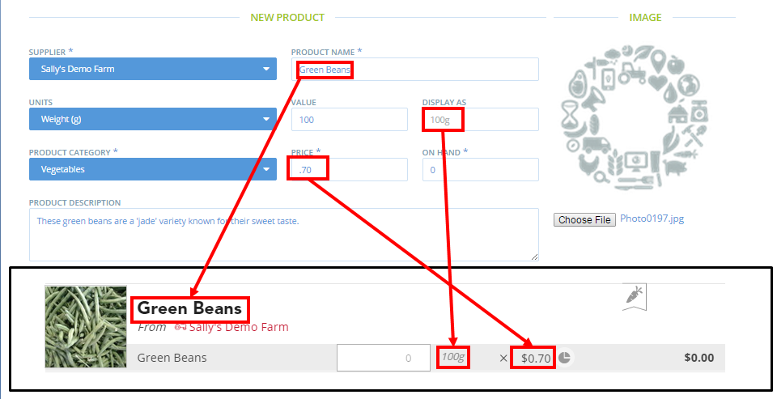
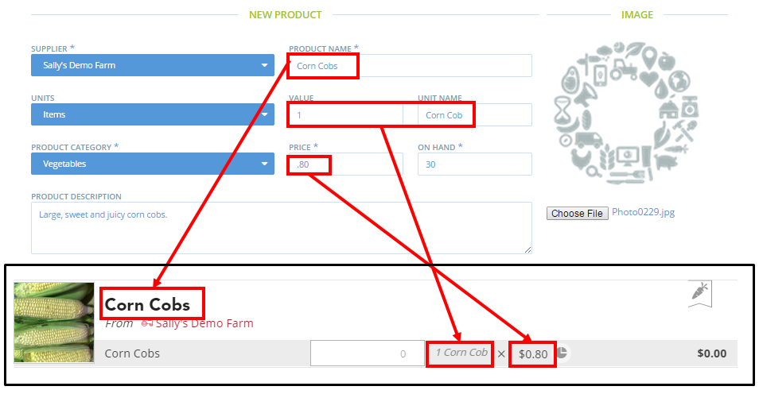
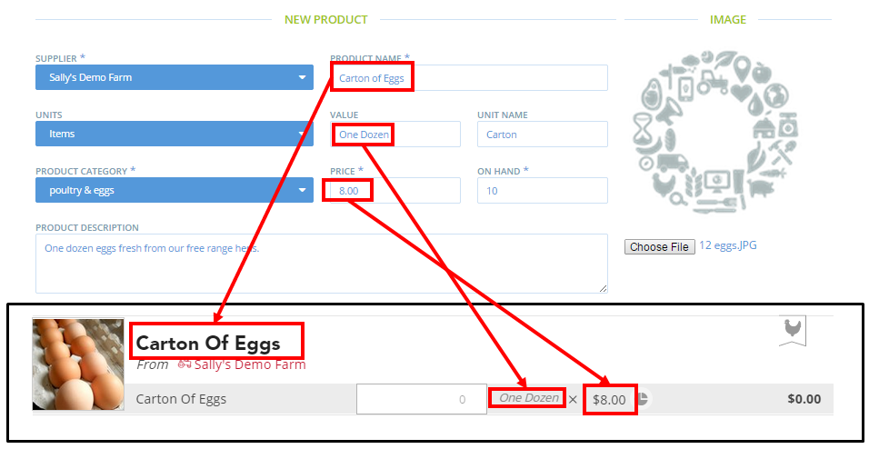

# Productes

### Addició de productes

Feu clic a **Productes** al menú blau horitzontal i, a continuació, feu clic a **+ Nou producte**.

Això us portarà a la pàgina de **Nou producte**.

**Proveïdora**: seleccioneu l'organització que produeix i subministra el producte.


Si sou una productora, això serà la teva empresa. Si sou un grup, recordeu que només podreu afegir productes als perfils de productores que heu creat vosaltres o si se us ha concedit permís per gestionar els productes d'un perfil de productora. Vegeu _aquí_ més informació.


**Nom del producte**: afegiu un títol. Així es mostrarà el producte a la botiga.  

**Unitat de mesura**: trieu la unitat en què es ven el producte \(pes: g, kg..., volum: l; o element com manat, bossa, paquet\).  

**Valor**: trieu en quin valor es ven el producte \(és a dir: 100g, 2l, 1 manat\)  

**Mostrar com**: aquest camp mostra automàticament com es mostrarà a la botiga el valor i la unitat, un cop hagueu omplert els camps de les unitats de mesura i els camps de valor. \(és a dir, si unitat de mesura és = kg, i valor = 2, a la botiga es mostrarà com: 2kg\)  


Nota: Si heu seleccionat "elements" com a unitat, es mostrarà al camp amb el nom de l’element que hagueu triat, és a dir com el tipus d'element que és: ampolla, safata, manat, sac, bossa, etc.  


**Categoria del producte**: seleccioneu la categoria més adequada per a aquest producte.  

**Preu**: introduïu el preu que es correspon al valor anotat anteriorment. Aquest és el preu base marcat per la productora. Els càrrecs, taxes, comissions s'afegeixen en els apartats **Mètodes de pagament**, **Mètodes d’enviament** i **Comissions de l’organització**.


 A l'estat espanyol, si esculliu que el producte té IVA, el preu que poseu tindrà l'IVA inclòs. Si esculliu que el producte és lliure d'IVA, el preu que inclogueu serà lliure d'IVA. 


**Disponibilitat**: estat de disponibilitat del producte: quina quantitat del producte està disponible i preparada per a la venda. Utilitzeu aquest camp si voleu seguir els vostres nivells d'estoc. Quan els clients fan les comandes es redueix automàticament el nivell d’existències i quan la disponibilitat arriba a zero, el producte ja no serà visible a la vostra botiga. Si no voleu fer un seguiment de l'inventari d'aquesta manera, feu clic a "sota demanda".  

**Sota demanda**: si activeu aquesta casella indicareu que aquest producte sempre està disponible. Això atura el programari de seguiment de nivells d'inventari de productes, i en canvi sempre mostrarà que sempre hi ha existències del producte.  

**Descripció del producte**: expliqueu als vostres clients una mica sobre aquest producte.  

**Foto**: Pugeu una foto d'aquest producte.


Us recomanem utilitzar imatges clares, boniques i precises dels vostres productes. Fareu el producte més atractiu als clients.  


**Categoria fiscal**: si us agradaria que el preu d'aquest producte inclogués IVA, seleccioneu IVA en el menú desplegable. La productora o organització han de definir el càrrec d’IVA a _Configuració de l’organització_. Si deixeu aquest camp buit, o seleccioneu "cap" el preu no inclourà IVA.

### Afegir productes similars utilitzant "variants"

Si hi ha dos productes que són molt similars, però només varien en preu, mida o bé sabor , és millor crear una "variant" d'aquest producte, en comptes de crear múltiples productes separats.  

Per exemple, si veneu llimones per 1,80€/kg, o per 3€/2kg, podeu crear dues variants del producte "llimones", un per a cada combinació de preu/quantitat. O si veneu dos sabors de iogurt, cadascun dels quals serà una variant del producte general. Com crear variants de producte està tractat més àmpliament _aquí_.  

Una vegada que heu completat un producte, feu clic a **crea** o si voleu afegir-ne més, feu clic a **crear i afegir un altre**.  

Quan feu clic **crear**, se us conduirà a la pàgina **Editar diversos productes**, on podreu veure un resum de tots els vostres productes.

**Exemples**

Aquí sota trobareu alguns exemples de com fer una llista de diferents tipus de productes, i com aquest llistat es mostrarà a la vostra botiga en línia.

> Nota: Per a productes comercialitzats habitualment per kg, és millor llistar el producte en unitats de 100g o superiors. El client no pot demanar 300g de producte si la unitat és 1kg perquè només fer la comanda en nombres enters, indivisibles: en canvi si el producte està llistat en increments de 100g podrà demanar-ne 3 unitats. La mida dependrà del producte \(per exemple, la majoria dels clients no compra 1kg d’all\). Això farà que sigui més fàcil llistar i preparar les comandes.

#### Funcionalitats avançades relacionades:

* Variants de productes
* Posar preus irregulars, a elements indivisibles
* Propietats del producte \(p. ex: certificat CCPAE, gallines en llibertat, etc.\)
* Compra en grup, per a productes estocats en mesures a l'engròs

