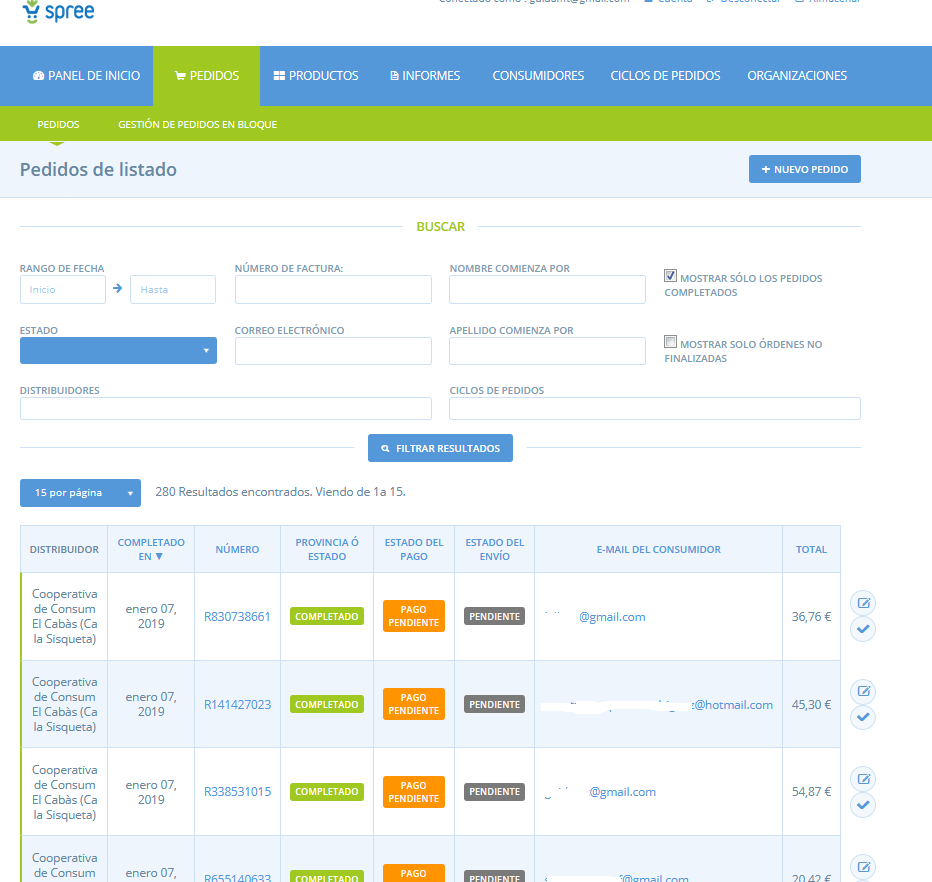
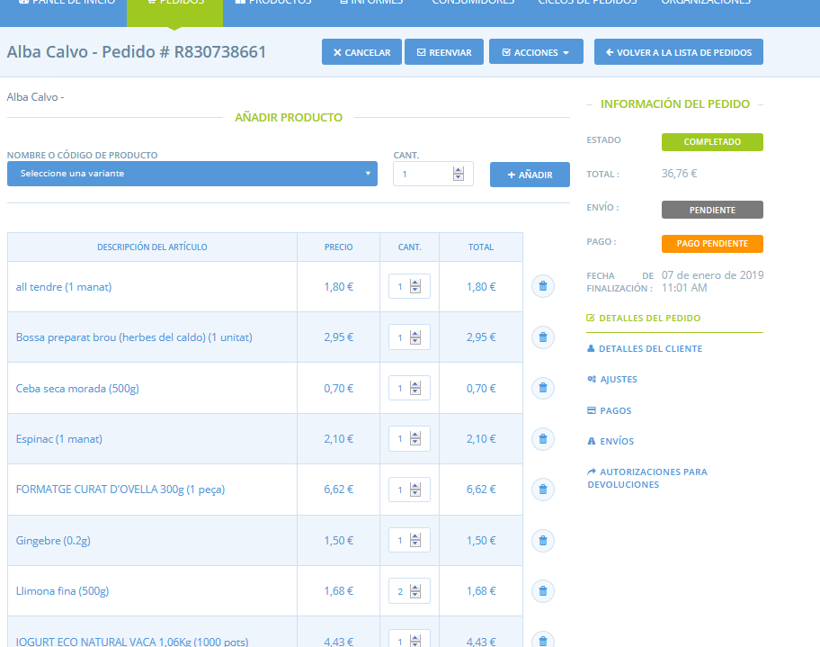
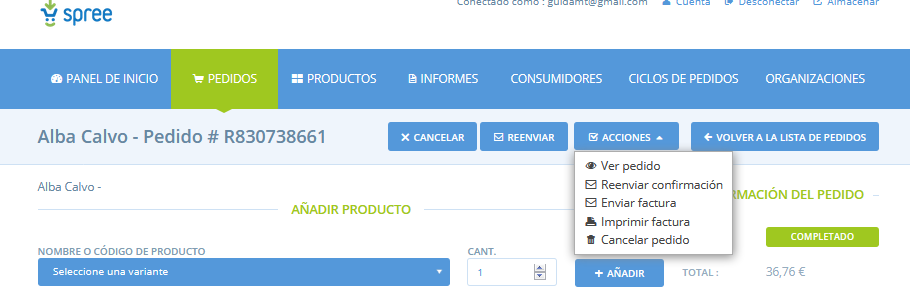
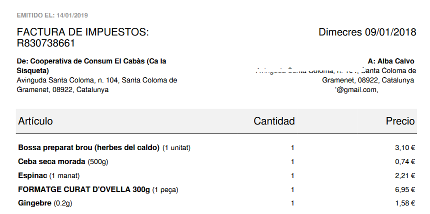
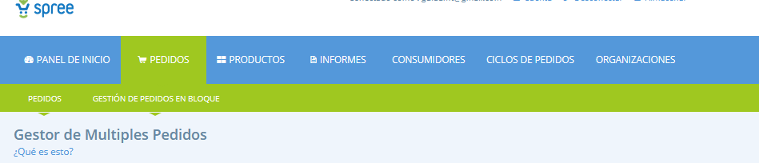
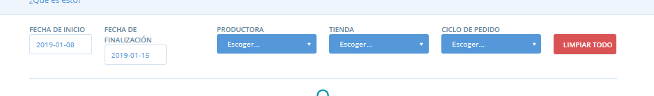
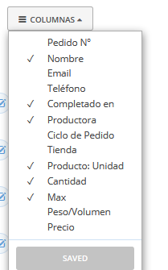

# Veure comandes

Podeu interactuar amb les comandes a través de dues pàgines dins de Katuma: a l’apartat **Comandes** a pàgines **Comandes** i/o **Gestió de comandes en bloc.** Les característiques d'aquestes dues pàgines es comenten més avall.

## Comandes

La pàgina de comandes mostra una llista de totes les comandes realitzades a través de la teva  botiga/es. Des d'aquí pot accedir a les dades de comandes individuals, editar comandes i fer seguiment de l'estat del seu pagament i enviament. Per a més detalls sobre com crear una nova comanda manualment per al client veure **aquí**.  

La pàgina té filtres que permeten seleccionar quines comandes voleu visualitzar. Podeu filtrar per data, estat o correu electrònic i nom del client.

**Distribuïdor**: Això és l'empresa a través de la qual s’ha fet la comanda.  
  
**Completada**: aquesta és la data en què s’ha confirmat la comanda.

**Nombre**: Aquest és un número de comanda assignat arbitràriament. Un símbol d'exclamació mostrarà si el client ha inclòs una nota a la seva comanda en el moment de la confirmació. Si passeu el ratolí per damunt el signe d'admiració per veure la nota.

**Estat**:

* Completa - la consumidora ha acabat la comanda.
* Cancel·lada - si l’admin edita la comanda i tria cancel·lar-la.
* Cistella - el client està en procés de compra, però no ha confirmat la comanda.

**Estat de pagament**:

* Pendent de pagament - si és efectiu, o transferència bancària la comanda constarà com a “pendent de pagament” per defecte, fins que l'administrador indica que el pagament s'ha rebut.
* Pagat - si s’ha pagat mitjançant Paypal o Pin això actualitzarà automàicament a “pagat” després del pagament. Si s’ha indicat manualment que el pagament s’ha realitzat, l’estat serà també "pagat".
* Crèdit a deure - si algú ha pagat per la seva comanda però llavors editeu la seva comanda i suprimiu un element, el cost d’aquest element es converteix en “crèdit a deure”.

**Estat d'enviament:**

* Pendent - quan l'estat de pagament és ‘pendent de pagament' l'estat d'enviament restarà ‘pendent’, és a dir que fins que no es rebi el pagament, l'enviament no començarà.
* Llest - quan rebem el pagament \(pagat, o crèdit a deure\) l'estat d'enviament es converteix en ‘llest'.
* Enviat - quan el producte s’ha editat i s’ha clicat el botó 'enviar' l'estat canvia a ‘enviat’.

Nota: _No es pot definir una comanda com a "enviada" a menys que l'estat de pagament sigui 'pagat'._  
  
**Correu electrònic del client**: correu electrònic de contacte del client. Una llista completa de correus dels clients es pot extreure al: **Informes** &gt; Consumidores &gt; Llista de correu.

**Total**: el valor total de la comanda del client.

#### Canviar l’estat de pagament i enviament d’una comanda

A la part dreta de la llista podeu actualitzar l'estat de pagament i/o enviament d'una comanda. Feu clic a la icona de la marca per indicar que el pagament s'ha rebut.

Feu clic a la icona de la carretera per indicar que la comanda s’ha enviat.

Feu clic a la icona d'edició \(per editar una comanda i veure’n informació més detallada\).

### 

### Editar una comanda

Després de fer clic al botó d’editar una comanda \(veure la imatge de dalt\) se us dirigirà a una visualització detallada de la comanda \(a baix\). Les funcionalitats dins d'aquesta pàgina es tracten a continuació:  

#### Afegir o eliminar productes d'una comanda

Podeu seleccionar un producte per afegir a la comanda. Per eliminar un producte, feu clic a la icona d'escombraries a la part dreta d'un producte. També podeu canviar la quantitat demanada. Recordeu **actualitzar** i **recalcular** el preu per desar els canvis.

**Enviar correu electrònic de confirmació**

Si feu canvis a la comanda del client, podeu enviar-li un correu electrònic de confirmació de comanda actualitzada.  

**Impressió del comprovant de compra**

Fent clic tindreu l'opció d'imprimir un comprovant de compra com a PDF o enviant-lo a una impressora.  

**Enviar comprovant de compra**

Per enviar un tiquet o comprovant de compra al client, feu clic al botó ‘enviar factura’. Això enviarà un correu electrònic al client amb un fitxer PDF adjunt com l'arxiu que apareix a sota:

**Anul·lar una compra**

Feu clic al botó ‘Cancel·la’ per anul·lar una compra.  

**Marcar una comanda com a pagada**

Per marcar una comanda com a pagada, cliqueu a la icona de marca a la pàgina de la llista de comandes. O feu clic a ‘pagament’ en el menú de la dreta i feu clic a la icona de la marca.

**Marcar una comanda com a enviada**

Després de rebre el pagament el botó ‘enviar’ serà visible a la part superior de la pàgina. Feu clic aquí per registrar que s'ha produït l'enviament.

### Veure els detalls de la consumidora

Fent clic a detalls del client en el menú de la dreta podreu tenir una visió completa de les dades del client.

### Afegir o restar al balanç de la comanda

Fent clic a **Ajustaments**.

Des d'aquí podeu eliminar comissions que ja estan en una comanda, o afegir/restar de la comanda total fent clic a **+** **Nou Ajustament**. També teniu la capacitat de seleccionar l'impost de l'ajustament. Recordeu, per a una comissió amb IVA, l'organització ha de definir l'impost en la configuració del perfil.

### Visualització per part de la consumidora de la seva comanda

Les seves consumidores poden veure una llista de les seves comandes quan es connectin a Katuma i facin clic al seu compte \(vegeu més avall\).

Aquí els clients podran veure les últimes comandes i pagaments, així com un balanç de les compres a la seva botiga. Això s’ha de mantenir actualitzat perquè els clients puguin visualitzar un balanç adequat.

## Gestió de comandes en bloc

Hem après anteriorment que la pàgina de la llista de **Comandes** mostra les comandes i detalls sobre qui és el client, quan fa la comanda etc. D'altra banda la pàgina de gestió de comanda en bloc et mostra tots els elements que s’han demanat en les seves comandes. En la **Gestió de comandes en bloc** podeu visualitzar tots els elements demanats i fer canvis a les quantitats dels productes, o suprimir determinats productes de comandes múltiples al mateix temps. Aquesta funcionalitat és útil per ajustar les comandes quan hi ha escassetat d'existències i cal destinar una quantitat limitada de producte al total de les seves comandes.  
  
Accediu a la **Gestió de comandes en bloc** clicant **Comandes** en el menú horitzontal blau i a **Gestió de comandes en bloc** en el menú horitzontal verd.

Dins la **Gestió de comandes en bloc** podeu aplicar filtres que mostraran només les comandes en les quals esteu interessats.

**Data d’inici i finalització**: podeu filtrar per mostrar totes les comandes que estan situades en una finestra de temps determinat.

**Productora**: podeu filtrar per a una determinada productora. Això pot reduir el desplegament si només està interessat en un producte subministrat per una productora.

**Botiga**: podeu filtrar segons la botiga al qual s’ha fet la comanda.

**Cicle de comanda**: potser és el filtre més útil. Mostrarà només aquelles comandes que estaven situades dins el cicle de comandes seleccionat.

**Recerca ràpida**: abans o després d'aplicar filtres, podeu limitar la recerca encara més per buscar una paraula clau. Podria ser un nom, producte, grup de consum, productora, data, número de comanda...

**Accions**: podeu seleccionar les caselles de selecció de comandes múltiples per realitzar una funció a totes ells, com ara suprimir.

**Columnes**: podeu seleccionar quins camps voleu o no voleu que es mostrin \(vegeu més avall\).

També podeu ordenar les files segons el contingut d'una columna. Per exemple, si feu clic sobre el títol de columna de ‘Data de la comanda’, la taula es concretarà en ordre cronològic, segons el valor en aquest camp. Fent clic a la capçalera de columna ‘Nom’ organitzarà la taula per ordre alfabètic del nom del client.  
  
\* Nota: _La columna de preu ordenarà les comandes per preus sense comissions, però inclourà IVA si el producte es posi amb IVA inclòs. Les comissions es recalcularan si editeu les comandes._

### Exemples de l'ús de la Gestió de comandes en bloc

#### Exemple 1: teniu una mancança d'existències i cal reduir les quantitats demanades pel client per a un determinat producte.

En el seu cicle actual de comanda, els clients han demanat 20kg de tomàquets. Per desgràcia, hi va haver tempesta i només n’ha pogut collir 10kg. Cal identificar tots els usuaris que va demanar tomàquets i reduir la seva quantitat de tomàquets demanada.

Això es pot fer en la **Gestió de comandes en bloc**, fent el següent:

* Filtreu segons l'interval de dates, o cicle de comanda.
* Cerqueu "tomàquets”. Totes les comandes de tomàquets dins les dates/cicle se us mostraran.
* Feu clic sobre el producte 'Tomàquets' a la columna: ‘Producte: Unitat’.
* Un quadre apareixerà a la part superior de la pàgina i us mostrarà la quantitat total demanada \(a través del rang de dates/cicle de data que heu seleccionat\).

Llavors podeu ajustar la quantitat de cada comanda única a la columna de quantitat. La quantitat total de producte demanat al quadre de la part superior actualitzarà automàticament les comandes, en aquest cas cap avall ja que ha reduït la quantitat de tomàquets disponibles.

Podria també llavors veure els correus electrònics d'aquests clients i enviar-los una alerta.

_Nota: No es genera automàticament una alerta als clients quan es fan ajustos en la gestió de comandes en bloc._

\_\_

#### La casella de selecció 'Recurs compartit'

A la captura de pantalla del damunt veureu una casella que diu "recurs compartit" a la cantonada superior esquerra. Quan seleccioneu aquesta casella el total mostrat inclourà totes les variants de producte que recauen sota el producte principal. Si no la seleccioneu podeu veure el total d'una variant. En el següent exemple, veureu que quan se selecciona el quadre de recursos compartits, el total inclou les variants i el producte principal comandes, per tant les vostres variants de d’1kg de poma i la vostra variant de 3kg de poma. Així que sabreu que en total, necessiteu 5kg de pomes. Si només vol saber quantes bosses de 3kg heu d’empaquetar, podeu desmarcar el quadre de recursos compartits i fer clic a la variant de 3kg de la columna: unitat de producte.

  

#### Exemple 2: Actualitzar el pes final dels productes.

Quan venem productes indivisibles com cuixes de xai o carbasses, no podem saber el pes final i el preu del producte fins després que el client ha fet el seu ordre. Podeu utilitzar gestió de comandes de en bloc per actualitzar el pes exacte de l'element quan tingueu el producte davant vostre.

Utilitzarem una cuixa de xai per il·lustrar l’exemple. En aquest cas la productora cobra tots els clients un preu estàndard per / kg de carn de xai i llavors ajusta seves comandes després de la matança, quan sap el pes exacte del producte assignat a cada client. Per fer aquests ajustaments el productor faria el següent:

* Filtra pel cicle de comanda o data d'interès.
* Buscar la cuixa de xai per veure totes les comandes de client per a aquest producte.
* Feu visibles les columnes Pes/volum i Preu.
* Introduïu el pes real de la cuixa de xai que cada client rebrà a la columna de pes/volum. El preu automàticament es torna a calcular en base a aquest pes.
* Feu clic a Actualitza.

Consulta preus d’elements carn irregular, indivisibles per obtenir més informació sobre els preus de productes com aquest.

  

####  

  

