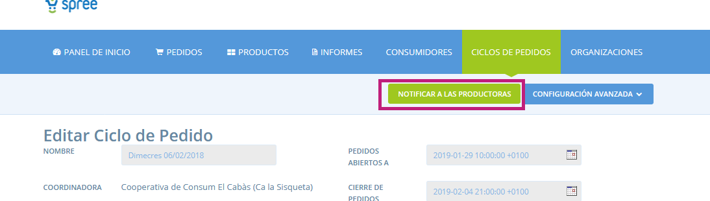

# FAQS - Preguntes freqüents

#### S’envia un correu per notificar al productor quan s’ha tancat el cicle de comanda?

De manera automàtica no. Per notificar al productor podeu entrar a la pàgina d’edició del cicle de comanda i allà fent clic al botó `NOTIFICAR A LAS PRODUCTORAS`

#### Per què no puc eliminar un cicle de comanda en concret?

Si el cicle de comanda té comandes associades no es pot. Si per contra, ningú hi ha fet cap compra, ens apareixerà el botó de la paperera a la llista de cicles de comanda per poder-lo eliminar.

#### Si sóc un productor, com puc consultar les comandes que m’han fet?

Has d’anar a la secció **`Informes`** i clicar a l’informe “totales del distribuidor por proveedor del Ciclos de Pedido” per poder veure un llistat de les comandes que t’han fet. Trobaràs més detalls [aquí](https://guia.katuma.org/~/edit/drafts/basic-features/informes). 


Anirem ampliant aquesta secció de la guia quan apareguin preguntes freqüents per part de les usuàries de la plataforma. Si considereu que hi ha alguna pregunta que no queda recollida ens podeu escriure a info@katuma.org


#### Des de la perspectiva d'un grup: cal que obri un cicle de comanda  diferent per a cadascun dels meus productors?

No. De fet, no és recomanable, sobretot si tots els cicles obren i tanquen amb les mateixes dates. És molt més còmode i fàcil de gestionar obrir un sol cicle de comanda i, dins d'aquest cicle, incloure-hi com a proveïdors \(a la pestanya d'entrant\) tants productors com vulguem. D'aquesta manera d'un sol cop d'ull podem veure a la botiga tots els productes disponibles en aquell cicle de comanda. I si ho necessitem, per fer l'experiència de compra més còmoda i neta, les consumidores podran filtrar per productores, si ho desitgen. 

#### Sóc productora, he fet canvis en el meu llistat de productes i els grups o clients a qui proveeixo diuen que no veuen els meus productes nous, per què pot ser?

Sempre que facis modificacions rellevants en el teu llistat de productes \(creació de noves variants, eliminació de productes, creació de productes nous, canvis en els formats, etcètera\), recorda revisar en l'apartat **entrant** dels cicles de comanda que tots aquest canvis estigui marcats com a seleccionats. Per defecte sortiran deseleccionats i això vol dir que totes les modificacions que hem fet no seran visibles per a les consumidores i que es pot produir algun desajust si veuen preus desactualitzats.

#### Obro la botiga i no veig molts productes que el meu productor solia tenir disponibles. Què pot haver passat?

Recorda que un productor pot actualitzar en qualsevol moment quins productes té o no disponibles a la botiga. Si no els veus, pot ser o bé que els hagi marcat com a no disponibles perquè ja no els produeix o estan fora de temporada, o bé perquè ha actualitzat tot el seu llistat de productes \(n'ha canviat variants, ha creat productes nous, etcètera\) i no els teniu seleccionats al cicle de comanda. L'administrador del vostre grup ha de revisar sempre \(especialment quan una productora l'avisi que ha fet modificacions grans del llistat de productes\) que la casella "seleccionar tots" de l'apartat **sortint** del cicle de comanda estigui marcada per assegurar-vos que veieu tots els productes a la botiga.

#### Em descarrego un informe i no hi veig cap dada tot i saber que s'han realitzat comandes. Què estic fent malament?

Revisa que estiguis filtrant les dades que necessites correctament: segons l'informe, pots filtrar o pel nom del cicle de comanda, o per la distribuïdora, o per la productora o per la franja horària en què s'han produït les comandes que busques \(si ho fas així assegura't que estàs introduint les mateix hores d'obertura i tancament en què el cicle de comanda ha estat obert, o podries estar-te deixant comandes que s'han realitzat fora d'aquest rang de temps\). 

#### Tinc la necessitat d'enviar una còpia o imprimir un informe de Katuma en PDF. Ho puc fer?

Pots imprimir un informe directament de Katuma amb un accés directe des del teclat, fent clic a **Ctrl+P** \(Windows, Linux\) o **Cmd+P** \(Mac OS\) i seleccionant imprimir l'arxiu com a PDF.

#### Em vull descarregar un informe en CSV però un cop obert a l'Excel, no visualitzo les columnes correctament 

Si aquest és el teu cas, segueix aquests passos:

1. Descarrega't l'informe que desitgis de Katuma en CSV
2. Obre l'Excel
3. Ves a Dades &gt; Obtenir dades externes &gt; Importar arxiu de text
4. Selecciona en el quadre de diàleg "delimitat"
5. Seleccionar el delimitador, el caràcter que separa els valors en l'arxiu de text. En aquest cas, la coma.
6. Fer clic a següent fins finalitzar.

Seguint aquests passos hauries de poder veure les dades dels informes separades correctament per columnes

