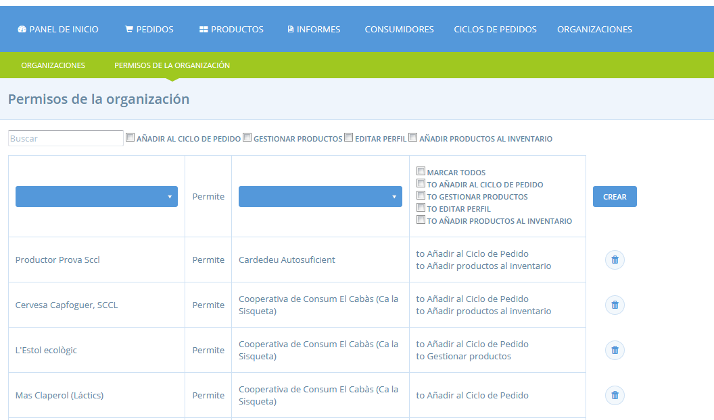

# Permisos E2E \(Enterprise to entreprise\)

## Permisos entre organitzacions E2E \(Enterprise to enterprise\) 

Dins d’OFN hi ha normes que regulen les relacions comercials entre organitzacions, que anomenem permisos d'organització a organització \(_E2E per les seves inicials en anglès: enterprise to enterprise_\). S'han d'atorgar certs "permisos" abans que una organització pugui actuar com a proveïdora d'una altra organització. De la mateixa manera, abans que una organització pugui distribuir en nom d'una altra organització, també s'han de concedir els permisos E2E adequats.

Aquesta pàgina proporciona una descripció dels diferents tipus de permisos E2E.

Les usuàries també podeu trobar-la útil per examinar els exemples específics de grups de consum, productores i grups de compra, etc.  

> Nota: els E2E poden ser bastant complexos, així que no dubteu a posar-vos en contacte amb la vostra instància local d’OFN \(Katuma\) per aclarir dubtes.

###    Diferents tipus de permisos E2E

Hi ha quatre tipus diferents de permisos E2E. L'aplicació d'aquests E2Es en diferents combinacions permeten a les organitzacions especificar exactament quants permisos, i sobre quins aspectes del seu compte, volen concedir a una altra organització.

**Permís per afegir al cicle de comanda \(P-OC\)**

**Permís per afegir a l'inventari \(P-I\)**

**Permís per gestionar productes \(P-P\)**

**Permís per editar perfil \(P-Profile\)**

### **Concessió i gestió dels permisos E2E**

Per concedir, veure i eliminar els permisos de E2E, feu clic a **Organitzacions** al menú horitzontal blau i, a continuació, a **Permisos de l'organització** al menú horitzontal verd \(a sota\). Aquí podeu veure els permisos E2E que heu establert prèviament, concedir-ne de nous o suprimir-los.

Si necessiteu que una altra organització us concedeixi un permís E2E, heu de posar-vos en contacte amb ells \(per correu electrònic o telèfon\) i demanar-los que us concedeixin permisos a través del seu compte. No hi ha forma de demanar permís dins de Katuma, i no podeu concedir E2Es d'una organització si no sou el propietari / gestor.

**Concessió de permisos E2E**

A la primera columna, seleccioneu el nom de l’organització que voleu que concedeixi el permís \(en aquest menú només veureu les organitzacions que teniu / gestioneu\). A continuació, a la tercera columna, seleccioneu l'organització a la qual voleu donar permís \(en aquest menú, veureu totes les organitzacions registrades dins de Katuma\). A continuació, feu clic als tipus de permisos que voleu concedir a la columna de la dreta. Podeu seleccionar qualsevol combinació, o "tot" per seleccionar-los tots. A continuació, feu clic a crear. També podeu suprimir permisos i reemplaçar-los en qualsevol moment.

### E2E generats automàticament

Quan un usuari té diverses organitzacions, els permisos E2E es creen automàticament entre elles. Això beneficia principalment els usuaris que posseeixen una organització d’un grup i també d’una productora que subministra el grup. La generació automàtica de certs E2E fa que la configuració d'aquest acord sigui molt més ràpida.

No es creen E2E automàtics entre organitzacions propietat de diferents usuaris

## E2E des de la perspectiva d'un grup 

Els següents escenaris demostren les estructures E2E requerides en diferents circumstàncies.

#### 1\) He creat perfils per les meves productores proveïdores, quins E2E necessito abans de poder emmagatzemar els seus productes a la meva botiga?

El sistema està configurat perquè els grups que creïn perfils de productores tindran els permisos correctes instal·lats de manera predeterminada, de manera que puguin començar a afegir productes i comercialitzar-los immediatament amb aquests perfils de productores.

Si un usuari té una organització de grup i crea una organització productora, automàticament la nova productora concedirà al grup els permisos P-OC i P-I.

De la mateixa manera, si un usuari és propietari d'una organització productora i crea un grup, el productor assignarà automàticament al grup els permisos P-OC i P-I.

_Distribuïu mitjançant grups de compra? Si és així, assegureu-vos de consultar els requisits d'E2E per a grups de compra més avall._

#### 2\) Vull emmagatzemar els productes d'una productora que ja és a Katuma a la meva botiga, quins E2E necessito?

Per començar a emmagatzemar els productes d'una productora que ja està a Katuma, heu d'obtenir els següents permisos d'E2E.

* Com a mínim, per emmagatzemar els productes d'un productor a la vostra botiga, necessiteu P-OC per afegir-los als cicles de la vostra comanda.
* Si voleu modificar el preu o el nivell d'existències del productor, necessitareu que us concedeixi P-I.
* Si tu o la productora vol que tu puguis gestionar \(afegir, editar, eliminar\) els productes de la productora, necessitaràs que la productora et concedeixi el permís P-P.
* Si la productora és feliç que tinguis permís per editar el seu perfil, també poden concedir-vos P-Profile.

_Distribuïu mitjançant grups de compra? Si és així, assegureu-vos de consultar els requisits d'E2E per a grups de compra més avall._

#### 3\) El meu grup \(o xarxa o cooperativa\) distribueix a través de petits grups de compra, quins E2Es necessitarà el grup de compra amb el meu grup i les meves productores?

Perquè un grup designi un grup de compra com a distribuïdor en un cicle de comandes, ha de tenir P-OC d’aquest grup de compra.

* Si l'usuari propietari de la xarxa o grup també és propietari del grup de compra, el permís P-OC es concedirà automàticament a la xarxa.
* Si la xarxa i el grup de compra són propietat de diferents usuaris, el propietari del grup de compra haurà de concedir P-OC a la xarxa per poder actuar com a distribuïdors.

A més, els grups de compra han de tenir P-OC de totes les productores, de qualsevol producte que es distribuirà a través del grup de compra.

* Si l'usuari propietari de les productores també és propietari del grup de compra, el permís P-OC es concedirà automàticament al grup de compra.
* Si les productores i el grup de consum pertanyen a diferents usuaris, el propietari del productor haurà de concedir manualment P-OC al grup de consum, que els permetrà distribuir els seus productes.

## E2E des de la perspectiva de les productores

Quan una productora vulgui començar a vendre els seus productes a través d'altres organitzacions \(xarxes, cooperatives o grups de consum\), haurà d'establir els permisos adequats d'E2E. Hi ha diferents nivells de permís que una productora pot concedir, depenent del poder que voleu donar a un grup per gestionar els vostres productes i el vostre perfil \(vegeu la part superior de la pàgina\).

Seguiu els exemples següents per explorar les vostres opcions.

#### 1\) Sóc productora i emmagatzemo els meus productes a través d'un grup. Quins E2E  necessito? Quines són les meves opcions?

* Essencial: perquè el grup pugui afegir els vostres productes a la seva botiga, haureu de concedir-los P-OC. Això permet que el centre emmagatzemi els vostres productes amb existències.
* Opcional: a més del P-OC, també podeu voler donar-los el permís per gestionar els vostres productes \(P-P\), editar el vostre perfil \(P-Profile\) o afegir a l'inventari \(P-I\).

#### 2\) Un**a xarxa** que subministro distribueix a través de grups de compra, he de donar-los el permís?

* Sí, si una xarxa o grup que subministreu distribueix productes a través de grups de compra o altres centres, també haureu de concedir-los P-OC. En cas contrari, no podran emmagatzemar els vostres productes a les seves pròpies botigues. De nou, podeu optar per concedir també a aquests grups de compra P-P, P-Profile o P-I si ho voleu. 

#### 3\) Tinc la meva pròpia a botiga a Katuma i també emmagatzemo els productes a través d'un grup. El grup vol que els doni P-P perquè puguin canviar els meus nivells d'existències i els preus dels productes però això tindrà repercussió en la forma en què dirigeixo la meva botiga. Què hauria de fer?

L'escenari descrit es pot resoldre mitjançant la concessió de P-I \(Afegir a l'Inventari\). Això permet el grup d'emmagatzemar els seus productes a la seva botiga, però establir els seus propis preus i nivells d'inventari. Quan emmagatzemeu la vostra pròpia botiga amb els vostres productes, continuarà reflectint els preus i els nivells d'existències que vosaltres heu establert.  

  

  

