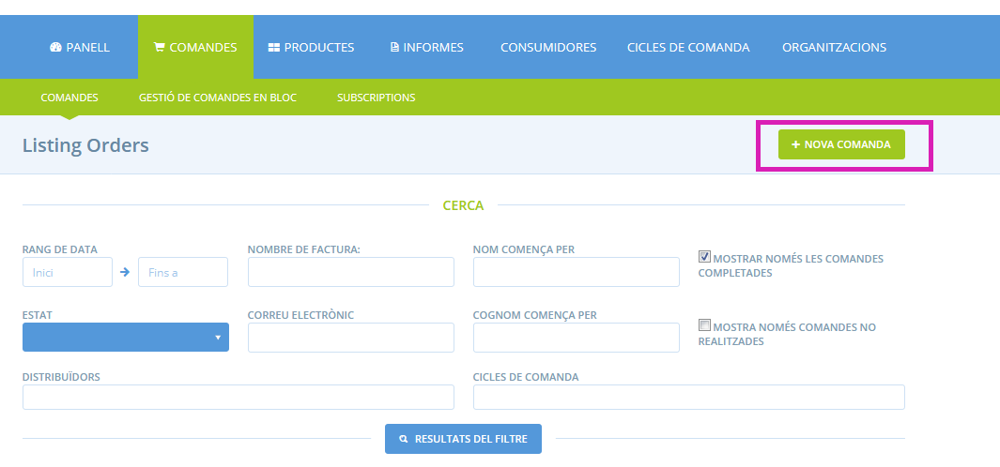
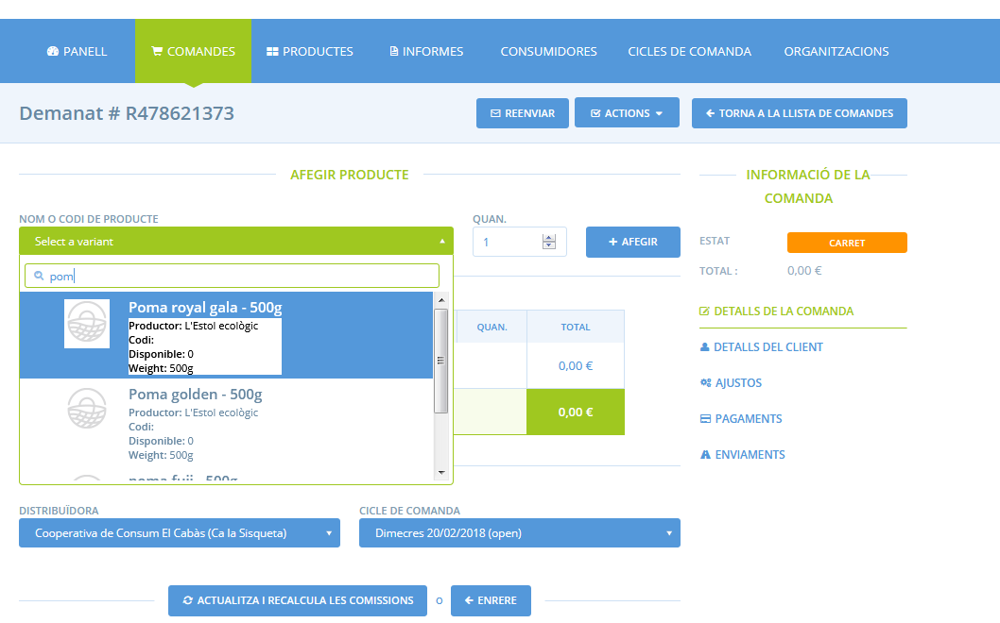

# Crear comandes manualment

De vegades desitgeu entrar una comanda al sistema manualment. Això pot ser perquè vulgueu fer-ho en nom d'un client, o perquè els vostres informes capturin informació d'una comanda que prové d'un altre lloc de venda. Podeu crear una comanda anant a **Comandes** i fent clic al botó de **+Nova comanda**.

En primer lloc se us demanarà que seleccioneu el distribuïdor amb el quales realitzarà la comanda. Això serà gairebé sempre la botiga d'un grup de consum o d'una productora, però podrien existir altres casos. A continuació necessiteu seleccionar el cicle de comanda on voleu que s'inclogui la comanda. La vostra elecció de cicle de comanda dictarà quins productes estan disponibles per afegir a la comanda i quines comissions s'hi apliquen. Per exemple, si seleccioneu el cicle de comandes 'Juny', no podreu incloure productes a la comanda que no estiguin disponibles en aquest cicle de comandes.

Ara podeu seleccionar quins productes afegiu a la comanda cercant-los pel nom o codi i seleccionant-ne la quantitat. Una vegada heu afegit tots els productes necessaris feu clic a **actualitza i recalcula les comissions**.

El següent pas és afegir els detalls de la consumidora. Si és una consumidora que és a la vostra llista de consumidores, podeu seleccionar-la al menú desplegable, o pel contrari, si no en forma part podeu omplir els detalls i validar la permetre'n la comanda com a convidats.

Feu clic a **Continuar** per seleccionar un mètode d'enviament. Després feu clic a **Actualitzar**.

Després se us permetrà fer qualsevol ajustament a la comanda com per exemple incloure una comissió o recàrrec. Una vegada heu fet això feu clic a **Continuar**. 

Finalment podeu seleccionar el mètode de pagament escollit per aquesta consumidora. 

Fent clic a **actualitzar** finalitzareu aquesta comanda i s'enviarà un correu electrònic de confirmació a la consumidora. 

