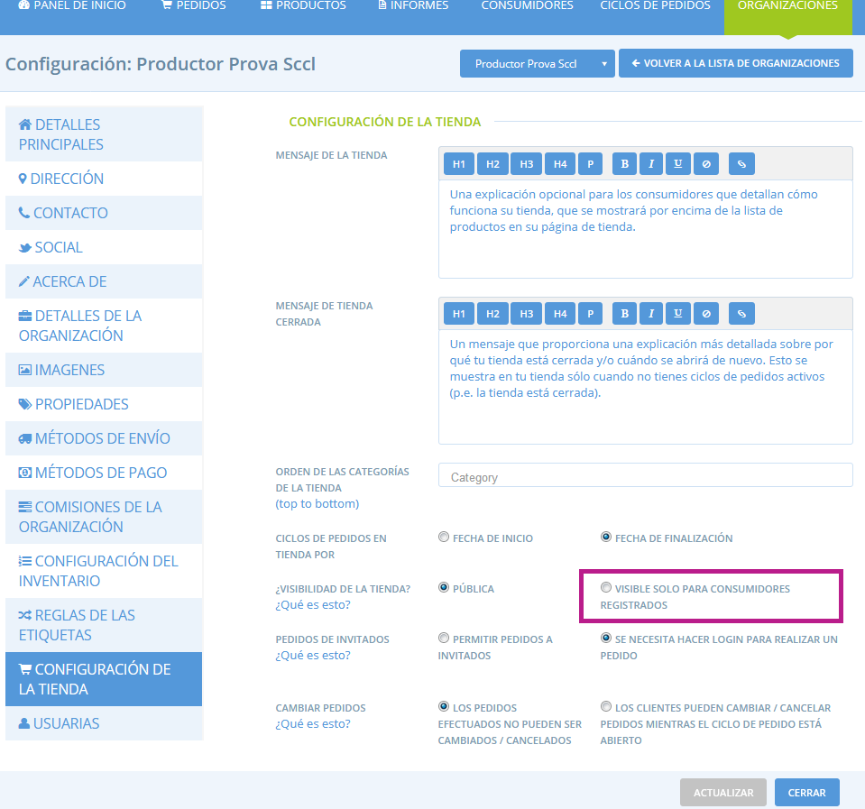
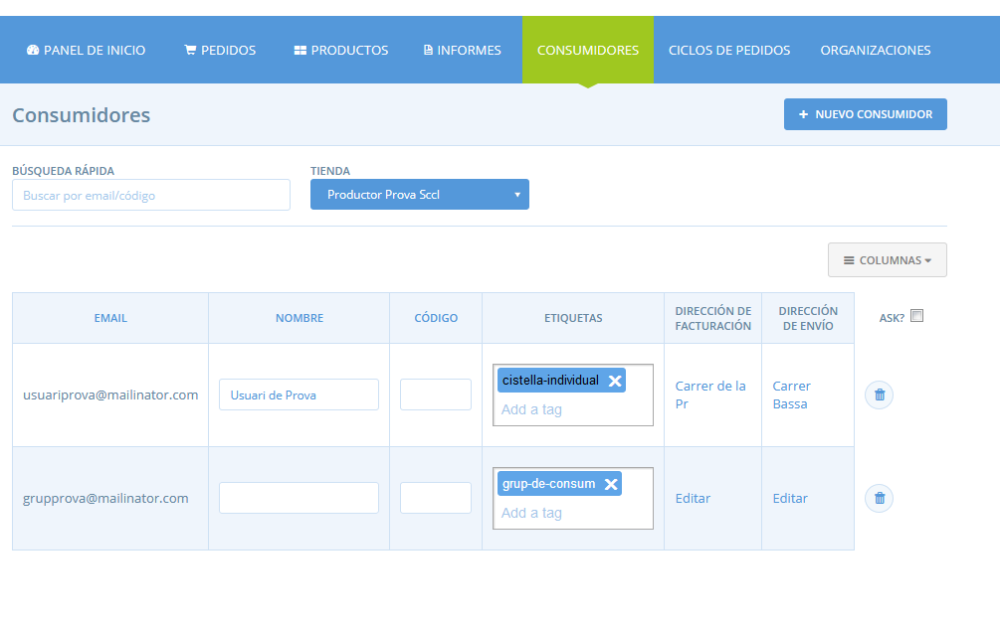
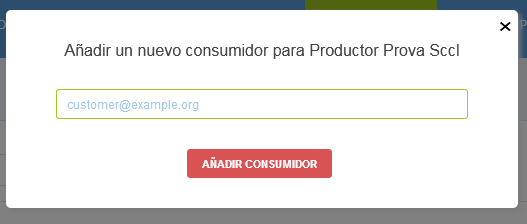
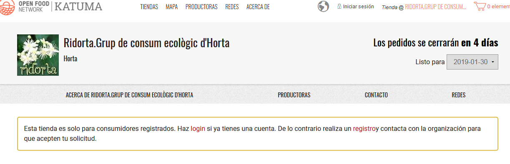
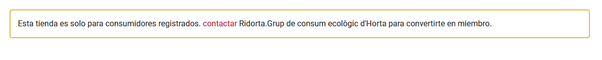

# Botiga privada

Si no voleu que la vostra botiga sigui visible per al públic o que algú pugui fer la comanda amb vosaltres, hi ha dues maneres de fer la botiga privada.

## 1\) Feu la botiga privada

A la [Configuració de l'organització](https://guia.katuma.org/basic-features/configuracio-de-lorganitzacio), a Detalls principals, podeu configurar el vostre perfil com a "invisible". Quan sigui invisible, el vostre perfil no es mostrarà al directori i el mapa de Katuma. A més, la botiga no es mostrarà al directori de les botigues de Katuma. L'única manera que les persones puguin navegar a la vostra botiga és si els proporcioneu l'URL. 

Aquesta pot ser una manera senzilla de limitar el nombre de visitants nous que arriben i poden fer una comanda a la vostra botiga.


Un desavantatge d'aquest enfocament és que ja no sou visibles al directori de Katuma, fent-vos menys visible al moviment local d'aliments justos.


## 2\) Botiga visible només per a usuàries registrades

Una manera estricta però que requereix una mica més de temps és fer que la vostra botiga només sigui visible per a les vostres consumidores conegudes. Aquesta funcionalitat és útil per a aquells grups o cooperatives que funcionen amb sòcies o botigues a l'engròs. Si opteu per tenir una botiga visible per a usuàries registrades necessitareu mantenir la vostra [llista de consumidores](https://guia.katuma.org/funcionalitats-avancades/configuracio-de-la-botiga/consumidores) actualitzada per portar el control de quines consumidores poden accedir a la vostra botiga. Només les consumidores el correu electrònic de les quals aparegui a la vostra llista de Consumidores podrà iniciar sessió i veure la vostra botiga per fer-hi una comanda. Qualsevol nova consumidora que vulgui comprar a través de la vostra botiga haurà de contactar-vos primer, i vosaltres haureu d'afegir-la manualment a la llista de consumidores.

Podeu fer la vostra botiga privada anant a **Configuració de l'organització &gt; Configuració de la botiga** i seleccionar '**visible només per a usuàries registrades'**.

Haureu de mantenir actualitzada la vostra [Llista de consumidores](https://guia.katuma.org/funcionalitats-avancades/configuracio-de-la-botiga/consumidores), la qual controlarà quines usuàries poden accedir a la vostra botiga. 

La vostra llista de consumidores ja inclourà totes les consumidores que anteriorment han fet una comanda a la vostra botiga. També podeu afegir consumidores manualment abans que hi comprin fent clic a **+ Nou consumidor**. A continuació, en el futur, si vénen a comprar a la vostra botiga, podran iniciar la sessió i tindran l'accés per comprar-vos.

### Com canvia l'experiència de compra quan la vostra botiga és privada?

Quan un visitant arriba a la vostra botiga, si encara no ha iniciat sessió es troba amb el següent missatge de la imatge.

A partir d'aquí hi ha 2 camins: 

a\) Si la consumidora inicia sessió, o es registra a Katuma amb una adreça de correu electrònic que es troba ja a la llista de clients de la botiga, se la portarà a la botiga com de costum. 

b\) Si la consumidora inicia sessió o es registra a Katuma amb un correu electrònic que no es troba a la llista de clients de la botiga, veurà el missatge següent. Poden contactar amb l'organització que gestiona la botiga per sol·licitar-ne l'accés.

