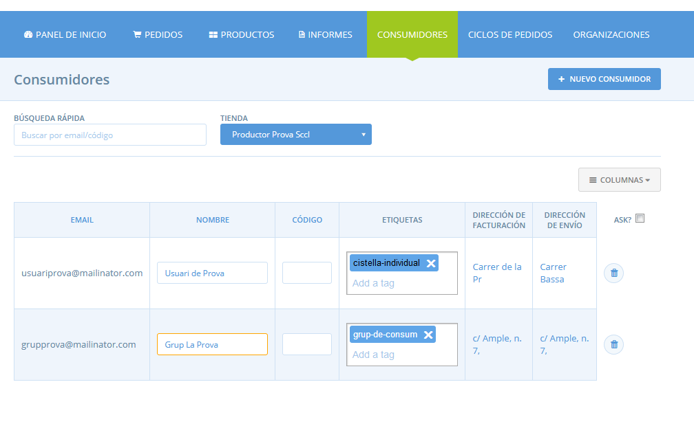

# Consumidores

Al menú blau horitzontal trobareu la pestanya **Consumidores**.

La pestanya de consumidores conté la llista de totes les consumidores de la vostra botiga. Aquí podeu mantenir informació sobre les vostres consumidores com la seva adreça d'enviament o facturació, adreça, etiquetes, codis o el seu nom complet.

Hi ha algunes altres eines a Katuma que tenen relació amb la llista de consumidores, que inclouen:

* [Botigues privades](https://guia.katuma.org/~/edit/drafts/-LX-t9dv4emDcdKBMI5R/funcionalitats-avancades/configuracio-de-la-botiga/botiga-privada) que són visibles només per a consumidores aprovades
* [Regles d'etiquetes](https://guia.katuma.org/~/edit/drafts/-LX-t9dv4emDcdKBMI5R/funcionalitats-avancades/configuracio-de-la-botiga/etiquetes-i-regles-de-les-etiquetes) les quals s'usen per controlar la visibilitat de certes coses a certes clientes \(incloent productes, cicles de comanda, mètodes d'enviament o de pagament\).
* [Subscripcions](https://guia.katuma.org/~/edit/drafts/-LX-t9dv4emDcdKBMI5R/funcionalitats-avancades/subscripcions) que es poden aplicar a consumidores que estan a la vostra llista de consumidores.

## Mantenir la vostra llista de consumidores

Qualsevol consumidora que hagi realitzat una comanda a través de la vostra botiga a Katuma apareixerà a la vostra **pàgina de Consumidores**. Cada únic correu electrònic fet servir es llistarà com a consumidora única.

També podeu afegir correus electrònics de consumidores a la llista escrivint el correu al camp d'**Afegir nova consumidora**. Una vegada les consumidores són a la vostra llista, se us permetrà afegir les seves adreces, codis o etiquetes.

**Nom**: podeu desar un nom per a aquesta consumidora, per a la vostra pròpia referència.

**Codi**: podeu aplicar un codi de consumidora. Aquest codi no té cap impacte o acció associada. L'únic lloc on el codi serà visible serà en alguns dels informes. Afegir un codi us pot ajudar amb els vostres informes.

**Etiquetes**: les etiquetes es poden usar per personalitzar l'experiència de compra per a cert tipus de clientes o consumidores. Vegeu [etiquetes i regles de les etiquetes](https://guia.katuma.org/~/edit/drafts/-LX-t9dv4emDcdKBMI5R/funcionalitats-avancades/configuracio-de-la-botiga/etiquetes-i-regles-de-les-etiquetes) per a més detalls.


Si esteu transferint un grup/botiga existent a Katuma de moment no existeix la manera d'importar la vostra base de dades de consumidores al sistema.


## Adreces d'enviament i de facturació de les consumidores

Es pot desar una adreça d'enviament i de facturació per a cada consumidora per defecte. Aquests detalls es desaran automàticament del sistema quan les consumidores comprin a la botiga amb la seva adreça de correu electrònic. O bé podeu sobreescriure aquests detalls a petició de la consumidora.

Quin és el benefici de desar els detalls de les adreces per defecte? Aquests detalls seran omplertes automàticament i farà el procés de la validació de la compra més ràpid per a la consumidora. Aquests detalls també s'ompliran automàticament si trieu [crear una comanda manual ](https://guia.katuma.org/~/drafts/-LX-t9dv4emDcdKBMI5R/primary/funcionalitats-avancades/comandes/crear-comandes-manualment)per a la vostra consumidora o creeu una [subscripció](https://guia.katuma.org/~/edit/drafts/-LX-t9dv4emDcdKBMI5R/funcionalitats-avancades/subscripcions) per a una consumidora.

Si una consumidora canvia d'adreça també pot actualitzar la seva adreça predeterminada  durant el procés de validació i confirmació de la comanda, seleccionant la casella "guardar com a adreça de facturació predeterminada".

\*\*\*\*

