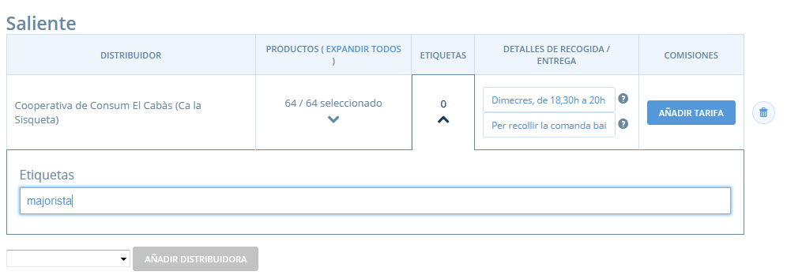

# Etiquetes i regles de les etiquetes

Usar etiquetes i regles d'etiquetes us permet personalitzar l'experiència de compra per a certes consumidores. Actualment això inclou:

* Fer visibles/no visibles algunes variants determinades.
* Fer visibles/no visibles certs mètodes d'enviament.
* Fer visibles/no visibles certs mètodes de pagament.
* Fer visibles/no visibles uns determinades cicles de comanda.

Sovint aquesta funcionalitat és necessària per a organitzacions que tenen diferents configuracions de la botiga per a membres/no membres del grup o diferents tipus de consumidores o clientes, com al detall o a l'engròs.

Utilitzar la funcionalitat de l'etiquetatge implica dos passos principals:

1. Aplicar una **etiqueta** a les vostres consumidores.
2. Configurar una **regla de l'etiqueta.**

### Etiquetar consumidores

La teva pàgina del llistat de [Consumidores](https://guia.katuma.org/~/edit/drafts/-LXx8NqhDlvvilERtCgD/funcionalitats-avancades/configuracio-de-la-botiga/consumidores) conté totes aquelles consumidores que han realitzat una comada a la vostra botiga, així com qualsevol consumidora que hagueu afegit manualment a la llista.

El primer pas per configurar una regla d'etiqueta és etiquetar totes les consumidores a les quals voleu aplicar la regla.

Per exemple, si voleu crear una regla la qual faci el lliurament gratuït disponible només per a consumidores majoristes, haureu d'etiquetar totes les consumidores majoristes amb la mateixa etiqueta.

Per crear una etiqueta escriviu-la a la columna **etiqueta** que està al costat de la consumidora i premeu el botó quan hagueu acabat. El nom de l'etiqueta no és important, per tant utilitzeu un nom que tingui sentit per a vosaltres \(les vostres consumidores no podran veure aquesta etiqueta\). Per aquest exemple podríeu utilitzar 'majoristes' o senzillament 'mj' si vosaltres ho enteneu.

> Nota: Heu d'escriure l'etiqueta exactament amb els mateixos caràcters cada vegada. Les etiquetes son sensibles a les majúscules.

Podeu afegir més d'una etiqueta a una única consumidora \(per exemple: es podria donar el cas que tinguéssiu una regla per a consumidores 'majoristes' i una regla per a consumidores 'prioritàries'\).

Algunes usuàries apliquen etiquetes a consumidores sense aplicar després cap regla d'etiquetes. Això és perquè les ajuda en els informes. 

Qualsevol etiqueta que pugueu aplicar a les consumidores també es mostrarà en l'informe **Totals de consumidores del Cicle de Comanda**  al costat de la comanda d'aquesta consumidora. Si voleu exportar aquest informe a CSV, a l'excel podeu filtrar els informes d'acord amb aquestes etiquetes, fent més fàcil ordenar les vostres comandes en base a certa informació. 

## Regles d'etiquetes 

Una vegada heu etiquetat totes les consumidores podeu definir com s'apliquen certes característiques a consumidores amb diferents etiquetes. Actualment podeu usar etiquetes per canviar quatre elements:

* Fer visibles/no visibles algunes variants determinades.
* Fer visibles/no visibles certs mètodes d'enviament.
* Fer visibles/no visibles certs mètodes de pagament.
* Fer visibles/no visibles uns determinades cicles de comanda.

Per configurar etiquetes aneu a Configuració de l'organització i seleccioneu **Regles de les etiquetes**.

### Per defecte

Per defecte, tots els elements seran visibles per a totes les consumidores tant si estan etiquetades com si no. L'enfocament general és crear una regla que dicti que certs elements \(variants, enviament/pagament, mètodes o cicles de comanda\) seran invisibles a certes consumidores que estan etiquetades. Tanmateix, si desitgeu canviar aquest valor per defecte, de manera que els elements etiquetats no siguin visibles fins que una regla que ho contradigui estigui configurada podeu fer-ho canviant les vostres regles 'Per defecte'.

 L'exemple inferior mostra que els meus mètodes d'enviament etiquetats 'majorista' \('_wholesale_'\) seran ara invisibles per defecte. Si després vull fer aquests mètodes d'enviament disponibles per a consumidores etiquetades 'majoristes' necessitaré configurar una Regla d'etiqueta a baix anul·lant aquest valor per defecte.

### Regles de les etiquetes

Tenint en compte els valors per defecte configurats més amunt, podeu ara aplicar regles per variar les configuracions per defecte per a certes consumidores.

Primerament, necessiteu seleccionar a quina etiqueta s'aplicarà la vostra nova regla. Per fer això escriviu el nom de l'etiqueta al camp 'per a consumidores etiquetades'.

Després podeu seleccionar en quina condició es basa la vostra regla.

**Mostrar o ocultar variants a la botiga**

Aquesta regla us permet fer algunes variants visibles/no visibles a determinades consumidores. Perquè aquesta regla funcioni necessiteu haver etiquetat les consumidores i les variants de productes **del vostre inventari** amb la mateixa etiqueta. La captura de pantalla inferior mostra que la meva variant 10kg de pomes pink lady \('10kg _apple_'\) està etiquetada 'majorista' \('_wholesale_'\) a l'inventari. 

* **Invisible:** si les variants per defecte són visibles, podeu seleccionar fer-les invisibles per a consumidores amb una etiqueta particular.
* **Visible:** si per defecte les variants són invisibles, podeu seleccionar fer-les visibles per a consumidores amb una determinada etiqueta. 

L'exemple de sota mostra que les variants etiquetades 'majorista' \('wholesale'\) són invisibles per defecte. S'ha creat una regla per la qual les variants etiquetades 'majorista' són visibles només per a consumidores etiquetades 'majorista'.

**Mostrar o ocultar mètodes d'enviament**

Aquesta regla us permet fer mètodes d'enviament particulars específicament disponibles per a certes consumidores. Per fer que aquesta regla operi necessiteu haver etiquetat les consumidores i els mètodes d'enviament amb la mateixa etiqueta. Per etiquetar un mètode d'enviament, aneu a editar mètodes d'enviament i apliqueu l'etiqueta. Per exemple: el mètode d'enviament de sota s'ha etiquetat 'majorista' \('wholesale'\).

* **Invisible:** si per defecte els vostres mètodes d'enviament son visibles, quan configureu la regla 'mètodes d'enviament etiquetats-són invisibles' els mètodes d'enviament amb l'etiqueta s'ocultaran a les consumidores amb la mateixa etiqueta quan confirmin la comanda. Els mètodes d'enviament no etiquetades amb aquesta etiqueta seran visibles per a aquestes consumidores.

 

* **Visible:** si per defecte els vostres mètodes d'enviament etiquetats són invisibles, podeu fer-los visibles per a determinades consumidores configurant la regla d'etiqueta 'mètodes d'enviament etiquetats-són visibles' . Les consumidores sense etiquetes o amb etiquetes diferents seguiran sense poder veure aquests mètodes d'enviament en la confirmació de la comanda. ****

**Mostrar o ocultar mètodes de pagament**

Aquesta regla us permet fer mètodes particulars de pagament específicament disponibles o no  disponibles a consumidores particulars. Per fer funcionar aquesta regla has d'haver etiquetat les consumidores i els mètodes de pagament amb la mateixa etiqueta. Per etiquetar un mètode de pagament aneu a **editar mètode de pagament** i apliqueu una etiqueta. Per exemple: el mètode de pagament de sota s'ha etiquetat com a 'majorista' \('_wholesale_'\). 

* **Invisible:** si per defecte els vostre mètodes de pagament son visibles, quan configureu la regla a 'mètodes de pagament etiquetats-son invisibles' els mètodes de pagament amb l'etiqueta seran ocultats a les consumidores amb la mateixa etiqueta quan confirmin la comanda. Els mètodes de pagament sense etiquetar continuaran sent visibles a aquestes consumidores.

 

* **Visible:** si per defecte els vostres mètodes de pagament son invisibles, podeu fer-los visibles per a consumidores particulars configurant la regla d'etiqueta 'mètodes de pagament etiquetats-son visibles'. Les consumidores sense etiquetes o amb etiquetes diferents seguiran sense veure aquest mètode de pagament en la confirmació de la comanda.

**Mostra o oculta cicles de comanda a la meva botiga**

Aquesta relga us permet fer certs cicles de comanda visibles només per a determinades consumidores. Perquè aquesta regla estigui operativa necessiteu haver etiquetat les consumidores i el cicle de comanda amb la mateixa etiqueta. Per etiqueta un cicle de comanda vegeu la casella d'Etiquetes a l'apartat 'Sortint' d'un cicle de comanda.


Aquesta regla d'etiqueta està només disponible actualment per a perfils de grups.


* **Invisible:** si per defecte els vostres cicles de comanda són visibles, quan configureu la regla a 'Cicles de comanda etiquetats\_son invisibles' els cicles de comanda amb l'etiqueta seran ocultats a les consumidores amb la mateixa etiqueta. Els cicles de comanda no etiquetats seguiran sent visibles per a aquestes consumidores.

* **Visible:** si per defecte els vostres cicles de comanda són invisibles, podeu fer-los visibles per a determinades consumidores configurant la regla d'etiqueta 'cicles de comanda etiquetats\_son visibles'. Les consumidores sense etiquetes o amb diferents etiquetes no veuran aquest cicle de comanda.

