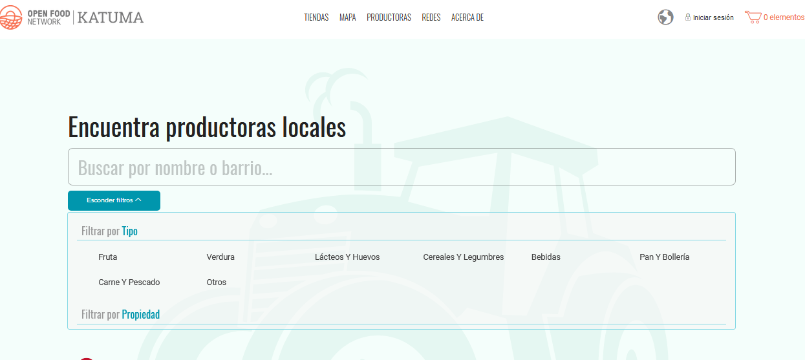
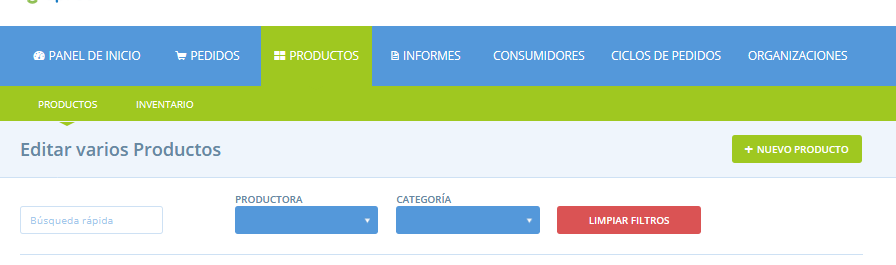

# Fer un perfil de productora cercable per categoria de producte

Quan les consumidores arriben a Katuma poden buscar productores per nom o per ubicació. També poden filtrar els perfils de productores d'acord amb els tipus de productes que realitzen o cultiven \(vegeu més avall\).

Les productores amb botigues en línia a Katuma tenen productes en el sistema, que són recollits per l'eina de filtre de cerca. No obstant això, les productores que no tinguin una botiga a Katuma \(sinó només un perfil\) no es podran cercar d'aquesta manera, tret que afegeixin alguns productes “falsos” al sistema. Si afegiu un producte fictici per a cada categoria de producte que voleu que es pugui cercar, apareixerà quan els clients cerquin els vostres productes.

A continuació s'explica com fer-ho:

Feu clic a **Productes** al menú blau horitzontal i, a continuació, feu clic a **+ Nou producte** per afegir els vostres productes ficticis.

Com que no teniu cap botiga a Katuma, aquest producte no serà visible enlloc. Per tant, podeu anomenar-lo com vulgueu i fixar-ne el preu i les unitats que vulgueu. L'important és que seleccioneu la **Categoria de producte** correcta que voleu que pugui ser trobada a sota. A continuació es mostra un exemple de producte “fictici” de carn. El perfil d'aquest productor ara es mostrarà si un client busca productors de carn malgrat no tingui una botiga oberta a Katuma.

El seu perfil resumit o fitxa també indicarà que ven productes carnis \(vegeu a sota\).

  
 

