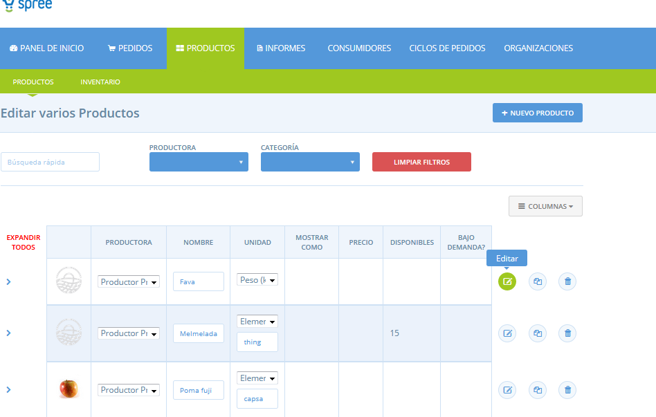
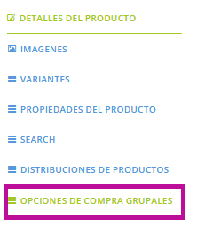
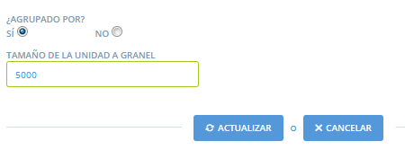

# Compra en grup: comprar a l'engròs

La funció de compra en grup està dissenyada per a organitzacions que adquireixen part de les seves existències en quantitats a granel. Per a aquestes organitzacions, la decisió de demanar un determinat producte dependrà de si les consumidores l’han encomanant col·lectivament en quantitat suficient com per justificar una compra a granel o a l'engròs. Això pot ser degut a descomptes per volum o bé per gratuïtat en les despeses d’enviament, per exemple. La funció de compra en grup facilita que un grup aconsegueixi una eficiència de compres conjuntes o l'engròs.

Quan un producte s’assigna a una compra en grup es mostrarà de manera diferent a la botiga \(vegeu més avall\).

Es demana a la consumidora que indiqui:

* **Una quantitat mínima**: aquesta és la quantitat del producte que desitja.
* **Una quantitat màxima**: aquesta és la quantitat màxima que estaria disposada a comprar.

Essencialment, aquesta és una manera perquè la consumidora digui "teniu el meu permís per augmentar la meva comanda fins a aquest punt, si això significa que, com a grup, podem aconseguir arribar a fer una comanda en grup".

A la **Gestió de comandes a granel** podeu veure les quantitats totals mínimes i màximes del producte, de totes les vostres consumidores. A continuació, podeu augmentar les comandes dels clients, dins del rang que han acceptat, per aconseguir la quantitat de compra en grup, o si la quantitat màxima de comandes és curta, podeu eliminar totes les comandes d'aquest producte.

## Aplicar "compra en grup" a un producte

Posem un exemple d'ametlles per il·lustrar, pel qual es requereix una quantitat total de comanda de com a mínim 5 kg per poder fer la compra mínima a la productora.

Per designar la funció de compra del grup a un producte, aneu a **Productes** al menú blau horitzontal i, a continuació, feu clic a **Edita** al costat del producte corresponent \(vegeu més avall\).

A continuació, seleccioneu **Opcions de compra grupal** al menú a la dreta.

Seleccioneu **Sí** a **Agrupar?** per activar aquesta funcionalitat al producte.

La mida de la unitat a granel és la quantitat que la comanda col·lectiva, la compra en grup, ha d'assolir. En aquest cas, necessitem una comanda total de 5 kg o més, així que escriurem 5000.

Nota: _La mida de la unitat de compra de a granel es troba en g \(per als productes venuts per pes\) i L \(per als productes que es venen per volum\)._

## Ajustar les comandes en la gestió de compres en grup \(comandes a granel\)

En la pàgina de **Gestió de comandes a granel**_,_ dins la pàgina de Comandes, podeu veure i editar comandes de consumidores per als productes de Compra en grup. En aquest cas, vull veure si les consumidores han demanat com a mínim 5kg d'ametlles. Si no ho han fet, també vull veure si puc augmentar les seves comandes, segons les seves quantitats màximes que ells han fixat per arribar a aquest llindar de 5kg.

1. En primer lloc, seleccionaria el cicle de comanda o altres dades d'interès.
2. Llavors busco el producte "ametlles".
3. Assegureu-vos que la columna "Max" es mostri per poder veure la quantitat màxima de cada consumidora.
4. A continuació, feu clic a Ametlles a la columna Producte: Unitat, per mostrar el quadre total de les comandes. Aquí puc veure les comandes mínimes i màximes acumulades. En aquest cas, la **quantitat total demanada** és de 4kg, que no arriba a la quantitat de comandes fixada de 5kg Però la **quantitat màxima demanada** és de 6 kg, la qual cosa demostra que algunes consumidores estan disposades a elevar les seves comandes.
5. A continuació, puc observar el valor màxim de cada client i augmentar la **Quantitat** de la comanda fins que s'arribi al llindar de 5 kg. Nota: els canvis a la quantitat es modificaran automàticament a la columna de preus.
6. Feu clic a Actualització per desar els canvis a les comandes dels clients.

#### _Què em diuen les informacions de: unitats realitzades i la comanda màxim realitzada?_

Les **unitats realitzades** divideixen la quantitat total demanada de totes les consumidores per la mida de la unitat de compra del grup \(en aquest cas: 4kg / 500g\). Si la xifra resultant és superior a 1, us informa que la comanda existent de la consumidora satisfà o supera la mida de la vostra unitat requerida de compra en grup. Si aquesta xifra és inferior a 1, les comandes existents de les consumidores no compleixen amb aquest llindar. A mesura que augmentin la quantitat de comandes de les consumidores, aquesta xifra augmentarà.

La **comanda màxima realitzada** recull la suma de totes les quantitats màximes de les consumidores i les divideix en la mida de la unitat de compra del grup. Si el nombre és superior a 1, sabeu que el total de les vostres comandes MAX supera la quantitat requerida de compra en grup. Si és inferior a zero, vol dir que fins i tot amb les quantitats de comanda MAX que han fixat les consumidores no arribareu al llindar mínim exigit per justificar una compra en grup.

### Informe de compra de grup

L'informe "Bulk Co-op-Totals per Proveïdors" proporciona un resum dels productes a granel, incloent-hi quantes compres en grup s'han demanat, quina quantitat d'estoc sobrarà si es fa la compra i no s'arriba a la quantitat mínim i quina quantitat d'aquest estoc extra estan les consumidores disposades a comprar per ajudar a assolir el grup la mida de la compra en grup. Per obtenir més informació sobre com utilitzar aquest informe, consulteu la part inferior d'[aquesta pàgina](https://guia.katuma.org/~/edit/drafts/-LWjvo029JtFWC1NGpT6/basic-features/informes).

