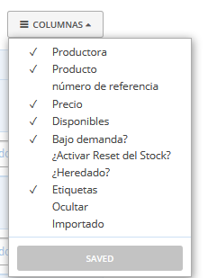

# Eina d'inventari

## Introducció a l'inventari

La pàgina d'**Inventari** dona a les organitzacions un major control i flexibilitat amb la seva gestió de productes, si ho requereixen. Això inclou la possibilitat d'anul·lar determinats detalls del producte, definir nivells d'existències regulars i amagar determinats productes per fer-los no visibles. No totes les organitzacions hauran d'utilitzar aquesta característica i és més rellevant per aquelles amb configuracions relativament complexes. Seguiu llegint per obtenir una explicació de la utilitat de les pàgines d'inventari i com utilitzar-les per obtenir resultats diferents.

Les pàgines d'inventari s'utilitzen per a tres funcions principals:

1. **Reemplaçament de detalls del producte**. La pàgina de productes conté la "llista mestra", la matriu, dels productes que un productor té en oferta. De vegades, una botiga potser hauria de variar els detalls del producte, com ara el preu, els nivells d'existències i el codi SKU d'aquesta llista mestra. La pàgina d'inventari permet a les organitzacions canviar alguns detalls del producte només per a la seva botiga. Qualsevol detall del producte que es modifiqui a la pàgina d'inventari superarà els detalls del producte principal. Tanmateix, si altres organitzacions també estan emmagatzemant aquests productes, els canvis realitzats a la llista d'inventaris no els afectaran.
2. **Ocultar productes i avaluar nous productes**. A la llista d'inventari, les organitzacions poden ocultar els productes que no volen veure, fent que la tasca de filtrar els productes que són a la botiga sigui més ràpida quan es tracti de grans quantitats de productes. També hi ha l'opció de tenir els nous productes afegits per productors ocults per defecte, fins que hagin estat aprovats per tu.
3. **Restabliment dels nivells d'estoc disponibles**. Les organitzacions que tenen existències que es restableixen regularment a una quantitat determinada poden definir aquest nivell recurrent d'existències disponibles per a cada producte i restablir els nivells ràpidament en bloc.

Nota: _l'ús de l'eina d'inventari pot ser complex, de manera que us animem a que us poseu en contacte amb la vostra instància local d'Open Food Network \(info@katuma.org\) per obtenir consells sobre la configuració específica._

### Requisits de permisos

Les organitzacions han d'obtenir el [permís E2E](https://guia.katuma.org/~/edit/drafts/-LWjZePF4oenoNkZ27yL/funcionalitats-avancades/col-laboracio-amb-altres-organitzacions/permisos-e2e-enterprise-to-entreprise) adequat de la productora proveïdora abans de poder veure els productes d'un productor a l'inventari.

* Un grup ha de tenir el permís E2E-Inventari \(P-I\) de la productora per veure els seus productes a l’Inventari.
* Els grups distribuïdors també necessiten el permís E2E-Inventari \(P-I\) de la productora proveïdora si cal emmagatzemar el producte segons l'inventari del grup. Sense aquest permís, hereten tots els detalls del producte principal.

## Configuració de l'Inventari

Abans d'utilitzar l'eina de l'inventari és important comprendre'n la configuració , ja que això impactarà en la manera en què les llistes d'inventari afecten en la gestió del producte.

Per veure la configuració de l'inventari, aneu a **Gestionar organització** i seleccioneu **Configuració de l'inventari.**

Podeu seleccionar si els nous productes afegits pels vostres proveïdors s'han d'afegir al vostre inventari abans de poder emmagatzemar-los a la botiga. Si no teniu intenció d'utilitzar l'eina d'inventari, seleccioneu “els nous productes es poden publicar a la botiga” per poder afegir nous productes a la vostra botiga sense haver d’afegir-los prèviament a l’inventari. D'aquesta manera, si creeu productes nous per als vostres proveïdors o, si el vostre proveïdor afegeix productes, estaran immediatament disponibles per ser afegits a la vostra botiga. Si utilitzeu la pàgina d'inventari, és possible que desitgeu que els productes "nous" es mantinguin ocults als cicles de comandes fins que hagueu escollit estocar-los a l'inventari. Si aquesta opció s'aplica al vostre cas, seleccioneu la segona opció a continuació.

## Accés a l'inventari

Feu clic a **Productes** al menú blau horitzontal i, a continuació, a l'**Inventari** al menú verd. Se us demanarà que seleccioneu la botiga a la qual aplicarà el vostre inventari \(si opereu més d'un botiga\). Recordeu que cada botiga té la seva pròpia pàgina d'inventari, i la configuració a la pàgina d'inventari només s'aplicarà a una botiga. Si teniu més d'una botiga, podeu establir diferents detalls d'inventari per a cadascun.

Quan visiteu primer la pàgina Inventari, veureu l'alerta "hi ha nous productes disponibles per afegir al vostre inventari". Fins que no afegiu els vostres productes a la vostra llista d'inventari, es mantindran a la llista de **Productes nous**.

Si feu clic a **Revisa ara**, us portarà a la vostra llista de **Productes nous**.

## Productes nous

Els nous productes es poden **Afegir** a la llista d'inventari o **Ocultar**. Si hi ha un producte a la llista per al qual voleu anul·lar detalls o aplicar un nivell d'existència recurrent, haureu d'afegir-lo a la vostra llista d'inventari. Si hi ha un producte que mai no voleu vendre a la vostra botiga o, si més no, no voleu emmagatzemar-lo en un futur pròxim, podeu optar per amagar-lo \(vegeu la secció de **Productes ocults** a continuació\).

Recordeu que si la **Configuració de l'inventari** està configurada perquè "nous productes s'han d’afegir al meu inventari abans que es puguin posar a la botiga", els productes que deixeu a la llista de nous productes estaran ocults. Si la configuració de l'inventari és "es poden posar productes nous a la meva botiga", els productes de la llista de nous productes es mostraran igualment al cicle de comandes.

## Productes d'inventari

La vostra llista de productes d'inventari és on podeu anul·lar els detalls del producte, configurar el restabliment del nivell d'estoc i amagar els productes. Quan seleccioneu veure totes les columnes, totes les funcionalitats de la llista d'inventari es faran visibles.

### Reemplaçament de detalls del producte

Podeu canviar els detalls del producte a la pàgina d'Inventari. Els canvis que realitzeu invalidaran els detalls del producte principal, i la vostra botiga i els informes reflectiran aquests valors que heu definit. Podeu invaldar el valor del codi SKU \(codi de referència de magatzem\), Preu, Disponibilitat i la configuració disponibilitat / **sota demanda**. No podeu invalidar el nom del producte, les unitats, la descripció o la fotografia.

* **SKU**: si voleu utilitzar un codi alternatiu per a un producte, podeu substituïr el codi SKU del productor aquí escrivint-ne un d'alternatiu.
* **Preu**: podeu establir un preu diferent per mostrar a la vostra botiga. Tingueu en compte que les unitats del producte continuaran sent iguals.
* **Disponibilitat**: podeu establir un valor diferent a disponibilitat. La vostra botiga marcarà el producte com a fora d’existències quan aquest valor de disponibilitat arribi a zero.
* **Sota demanda**: podeu seleccionar si voleu que un producte estigui «disponible» amb un valor determinat o «sota demanda».

### Restabliment de nivell d'estoc

La columna de restabliment del nivell d'emmagatzematge \(‘**¿Activar reset del nivell de stock?**’\) permet restituir la quantitat de Disponibilitat d’un producte a una **quantitat predeterminada**, per exemple, al començament de cada cicle de comandes nou. La **quantitat predeterminada** es pot entrar en aquesta columna al costat de la casella de selecció. La casella de selecció us permet escollir aquells productes que voleu reiniciar en qualsevol moment. Si hi ha un valor en aquest camp i la casella de selecció està seleccionada, quan feu clic a Inventari &gt; Accions &gt; Restableix els nivells d'estoc a valors predeterminats, tots els valors dels valors seleccionats a Disponibles del producte seleccionat tornaran al nivell designat. Per exemple, aquesta eina és útil per als productors que saben que cada mes sacrificaran 2 animals i, per tant, saben les quantitats de producte disponibles per a cada cicle de comandes.

### Hereta

Si no heu aplicat cap reemplaçament a les dades d'un producte, la casella d’**Heretar** es seleccionarà automàticament. Això us indica que les dades del producte s'extrauran de la llista de Productes mestra o matriu: aquests valors es mostren en gris. Quan feu una substitució, la casella no es seleccionarà, la qual cosa indica que alguns detalls del producte s'agafaran de la vostra llista d'Inventari, en lloc d'heretats de la llista de Productes. Si en algun moment voleu eliminar les vostres substitucions o reemplaçaments, podeu tornar a seleccionar **Heretar** i aquest producte tornarà a la configuració principal.

### Amaga

Igual que en la llista de **Nous Productes**, també podeu **amagar** els productes de la vostra **Llista d'Inventari**. Si feu clic al botó amaga, el producte passarà a estar a la llista de **Productes ocults.** Això té l'efecte de fer que desaparegui del cicle de comandes configurat i, per tant, desactivar l'opció d'afegir-lo a la vostra botiga.

Recordeu desar els canvis.

## Productes ocults

Aquesta llista mostra els productes que heu escollit amagar \(això es pot fer des de les llistes d'Inventari o de Nous Productes\). Això permet fer que la llista de productes sigui menys atapeïda per a aquells amb un llistat llarg de productes. Aquí podeu triar **+Afegir** per afegir-los novament a la llista de productes de l’Inventari. Això permetrà afegir-los als cicles de comandes novament i aplicar-los les funcions d'inventari.

## Inventari i cicles de comanda

En la configuració del cicle de comandes, al botó Configuració avançada, hi ha l'opció de controlar si l'inventari entrant de productes que apareixen a la botiga es llegeix des de l'inventari del coordinador o des la Llista de Productes mestra.

Si es selecciona la configuració de ‘**Tots els productes disponibles**’, l'inventari de productes entrant inclourà tots els productes de la pàgina de productes mestra. Això fa que els productes amagats \(i nous\) de l'inventari estiguin disponibles per a altres distribuïdors a la secció sortint. Tingueu en compte que si el coordinador és un distribuïdor, la seva selecció de producte sortint sempre estarà restringida per les seves pàgines i configuracions d'inventari.

Si es selecciona la configuració de '**només l’inventari del coordinador**', l'inventari entrant i, per tant, l'inventari de sortida a tots els distribuïdors, es restringirà als productes de l'inventari del coordinador. Els seus productes ocults no estaran disponibles a les seccions sortints, ni tampoc els seus nous productes \(si la seva configuració amaga els nous productes\). Qualsevol detall reemplaçat a l'inventari del coordinador no es farà arribar a les botigues del distribuïdor, p. ex. preu.

  

