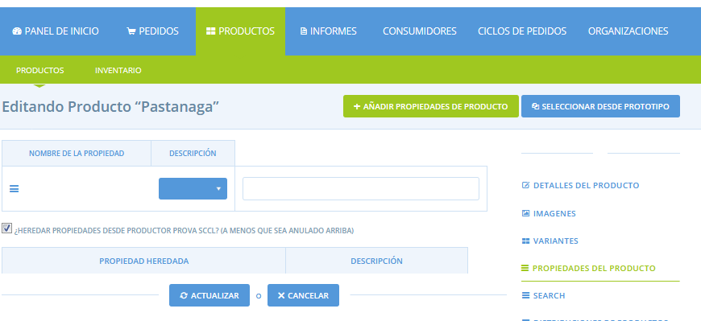

# Propietats dels productes


De moment aquesta funcionalitat no està habilitada a Katuma però sí en altres instàncies d'Open Food Network. Estem treballant perquè la pugueu fer servir properament.


Podeu aplicar propietats del producte als vostres productes, com una manera d'informar les vostres consumidores sobre la manera com es produeixen els vostres productes i quines són les seves característiques. Alguns exemples d'aquestes propietats podrien ser: ecològic \(certificat\); ecològic \(no certificat\); identitat geogràfica protegida; denominacions d'origen, etcètera.

_\* Si voleu aplicar una propietat del producte que no figura aquí, poseu-vos en contacte amb nosaltres i considerarem crear-lo_ _si hi ha una demanda generalitzada._

Hi ha dues maneres d'assignar propietats als vostres productes:

1\) Podeu assignar una propietat a una organització, de manera que tots els productes que pertanyin a aquesta organització portaran aquesta propietat \(llevat que es retiri manualment, la qual opció està explicada a la secció **Propietats heretades**, a continuació\).

2\) Podeu assignar propietats a productes particulars, de forma individualitzada.

## 1\) Assignar una propietat a una organització

Quan assigneu una propietat a una organització, tots els productes que pertanyin a aquesta organització portaran, de forma predeterminada, la propietat del producte. Per exemple, si tots els vostresnh  productes són 'amb certificat CCPAE', podeu assignar aquesta propietat a la vostra organització per estalviar-vos de la necessitat d'aplicar manualment aquesta propietat a cada producte. Si una propietat només s'aplica a alguns dels vostres productes, és millor aplicar-la al producte, en comptes de a l’organització \(instruccions a continuació\).

Podeu accedir a Propietats de l'organització a la [Configuració de l'organització](https://guia.katuma.org/~/edit/drafts/-LWXS4k4rQC0z457WaKh/basic-features/configuracio-de-lorganitzacio), a Propietats.


Les propietats només s'apliquen als perfils de productores, no als perfils de grups de consum.


A continuació, hi ha 2 camps en aplicar una propietat a una organització:

**Propietat**: podeu seleccionar una propietat de producte predefinida a la llista desplegable. Aquest és el nom de la propietat que etiquetarà els vostres productes i que els clients podran filtrar a la vostra botiga.

**Descripció**: podeu escriure una descripció de com s'aplica aquesta propietat del producte a la vostra organització en aquest camp. Per exemple, si heu seleccionat la propietat 'Certificat ecològic' al camp de la propietat, podeu escriure el número de certificació al camp de valor. O si heu seleccionat la propietat 'Pastura lliure', podeu escriure una descripció més detallada de com es generen els animals al camp de valor.

_\* Podeu aplicar diverses propietats a la vostra empresa._

## 2\) Assignar una propietat a un producte

Per assignar una propietat a un sol producte, en comptes de a un ampli ventall de productes d'una organització, feu clic a **Productes** a la bandera blava horitzontal i, a continuació, editeu un producte existent \(no podeu aplicar una propietat del producte quan creeu el producte el primer cop\).

Una vegada que esteu editant el producte, feu clic a la icona d'edició que hi ha a la dreta.

Hi ha 2 camps en aplicar una propietat de producte:

**Propietat**: podeu seleccionar una propietat de producte predefinida a la llista desplegable. Aquest és el nom de la propietat amb la qual es marcarà el vostre producte i que els clients podran filtrar a la vostra botiga.

**Descripció**: podeu escriure una descripció de com s'aplica aquesta propietat del producte a aquest producte. Per exemple, si heu seleccionat la propietat 'Certificat ecològic' al camp de la propietat, podeu escriure el número de certificació al camp de valor. O si heu seleccionat la propietat 'Pastura lliure', podeu escriure una descripció més detallada de com pasturen els animals al camp de descripció.

Podeu aplicar diverses propietats del producte fent clic a **+ Afegeix propietats del producte**.

Recordeu fer clic a **actualitzar** per desar els canvis.

## Propietats heretades

Com s'ha comentat anteriorment, quan una organització té assignada una propietat, tots els productes pertanyents a aquesta organització "heretaran" aquesta propietat. No obstant això, és possible que una organització no desitgi que tots els seus productes heretin aquesta propietat. Per tant, és possible eliminar aquesta propietat en alguns productes.

Quan editeu les propietats d'un producte, veureu un quadre de verificació anomenat **Heretar propietats de \(Nom de l'organització\) \(A menys que sigui anul·lat a sobre\)**. Per defecte, quan una organització té una propietat, aquesta casella es marcarà per a tots els productes que pertanyen a l'organització. Desmarcar aquesta casella eliminarà totes les propietats de l’organització que s'hagin heretat.

El component "A menys que sigui anul·lat a sobre" significa que si teniu un producte amb la mateixa propietat, heredtda i aplicada, el camp "descripció" de la propietat aplicat anul·larà la descripció de la propietat heretada. Per exemple: un productor es basa principalment en productes de carn de boví, a més d'algunes caixes d'ous. Ha aplicat la propietat de "pastura lliure" a la seva empresa, amb una descripció de "densitat de població de 4 bovins per hectàrea". El seu producte "dotzena d'ous" també comparteix la propietat de "pastura lliure" i per tant la pot heretar, però la descripció ha de ser "els nostres pollastres viuen en una densitat de 50 pollastres per hectàrees". La propietat de la dotzena d’ous pot tenir marcada la casella “Propietats heretades", però també necessitarà una propietat de "pastura lliure" creada, amb el camp de descripció correcte.

Podeu afegir propietats a un producte, a més d'aquells heretats de l’organització \(mantenint la casella de selecció i afegint una propietat a dalt\). O bé, podeu eliminar la propietat heretada i afegir-ne de més. Això permet als productes portar una combinació de propietats individuals i propietats de l’organització.

## Com es mostren a la botiga les propietats dels productes

A la botiga, les consumidores poden veure les propietats del producte fent clic a la finestra emergent d'informació del producte o bé fent clic al damunt de la imatge del producte.

Les propietats que s'apliquen al producte es mostren com una icona, al costat de la categoria de producte.

Les consumidores també poden cercar segons les propietats del producte dins d'una botiga. Aquesta eina està situada a la cantonada superior dreta de la botiga i permet al client cercar productes d'acord amb les seves propietats.

