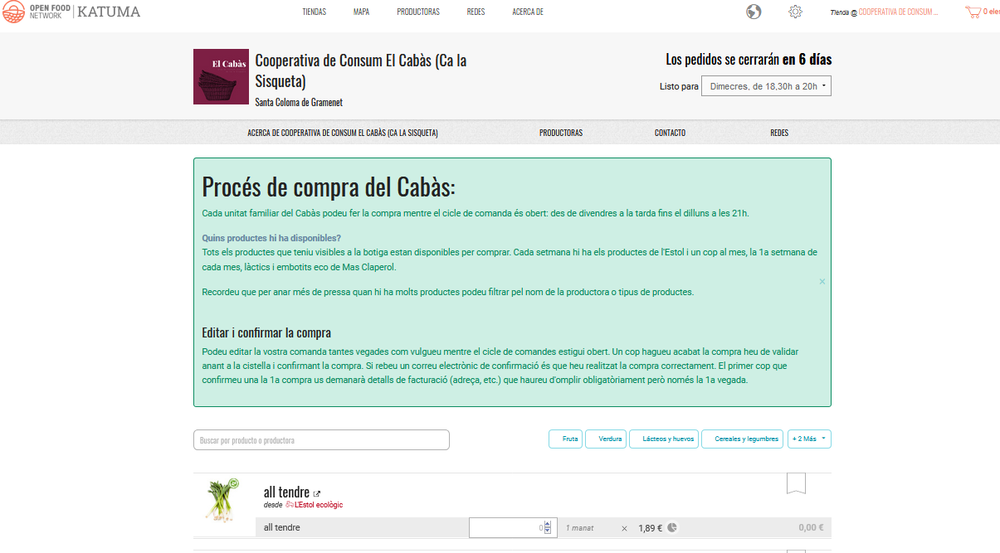

# Grup \(botiga\)

## Què és un grup amb botiga? 

Les botigues dels grups poden prendre formes diferents però en la seva essència són botigues en línia que emmagatzemen productes de diverses productores que els proveeixen i que sempre estan identificades. Amb una botiga de grup les consumidores podeu veure els perfils de les productores que fan créixer, cultiven, fermenten, couen el seu menjar.

Algunes exemples de grups poden incloure grups de compra a l'engròs, cooperatives de consum, agrupacions de consumidores, grups de compra, etcètera.

## Què fa una botiga d'un grup? 

**Una experiència de compra que les consumidores gaudiran** Amb una botiga d'un grup les consumidores podran veure els perfils de les productores que fan créixer, cultiven, fermenten, couen els seus aliments, la qual cosa els proporciona una experiència de mercat de pagès virtual.

**Optimitzeu les vostres tasques d'administració** A diferència d'agafar comandes per correu electrònic, text o missatgeria, agafar comandes en línia és més simple i us fa guanyar temps. Utilitzeu els informes de Katuma per entendre els vostres nivells d'existències, les vostres vendes, les vostres comandes i els vostres fulls d'embalatge, tot d'un cop d'ull.

**Agafeu comandes amb periodicitat** Podeu escollir quan voleu que la vostra botiga obri i tanqui i fer-la funcionar per cicles de comanda periòdics.

**Involucrar les vostres proveïdores** Les vostres proveïdores poden iniciar sessió directament a Katuma per actualitzar les existències dels seus productes i els preus, minimitzant algunes tasques d'adminisitració per al grup. 

**Sigueu flexibles** El nostre programari està dissenyat per ser flexible i acomodar-se a diferents models de negoci i d'organització de molts tipus i formes. Podeu usar la nostra flexibilitat per experimentar noves maneres de fer les coses. Podeu experimentar amb tot allò que us imagineu: provant d'afegir una segona data de lliurament, un nou punt de recollida, una nova manera d'organitzar-vos, etcètera. 

## Passos per configurar una botiga de grup 

1\) [Registreu el vostre perfil ](https://guia.katuma.org/~/edit/drafts/-LXOMsus6WN4wNrKUNha/basic-features/register-and-create-your-profile)a Katuma. Aquesta eina de configuració us demanarà per informació bàsica sobre la vostra organització per crear el perfil. Se us demanarà que confirmeu el correu electrònic.

2\) Seleccioneu el [tipus de perfil](https://guia.katuma.org/~/edit/drafts/-LXOMsus6WN4wNrKUNha/basic-features/tipus-de-perfils-disponibles) 'grup amb botiga'.

3\) Si voleu editar el vostre perfil o afegir-hi detalls podeu modificar-lo a la[ Configuració de l'organització](https://guia.katuma.org/~/edit/drafts/-LXOMsus6WN4wNrKUNha/basic-features/configuracio-de-lorganitzacio). Aquí podeu també escollir si la botiga serà oberta al públic o privada i escriure un missatge que apareixerà a la botiga.

4\) Definiu i configureu els [mètodes d'enviament](https://guia.katuma.org/~/edit/drafts/-LXOMsus6WN4wNrKUNha/basic-features/metodes-denviament).

5\) Definiu i configureu els mètodes de pagament.

6\) Definiu qualsevol [comissió de l'organització](https://guia.katuma.org/~/edit/drafts/-LXOMsus6WN4wNrKUNha/basic-features/comissions-de-lorganitzacio) que vulgueu aplicar a la botiga.

7\) [Creeu perfils o connecteu-vos amb les vostres productores proveïdores](https://guia.katuma.org/~/edit/drafts/-LXOMsus6WN4wNrKUNha/basic-features/creeu-o-connecteu-vos-amb-les-vostres-productores-proveidores). Necessiteu fer això abans de poder afegir productes a la botiga del grup. 

8\) Gestioneu els vostres productes.

Les instruccions següents per gestionar productes es desglossen d'acord amb la manera com hagueu configurat el perfil en el pas 7: ja sigui si heu a\) creat un perfil per a les vostres productores proveïdores; o si b\) us heu connectat a perfils de productores ja existents a Katuma.

**8a\) He creat el perfil per a les meves productores proveïdores** Si en el pas previ heu creat un perfil per a una proveïdora \(perquè no era a Katuma o no vol ser-hi en un futur immediat\), necessitareu també [afegir els seus productes](https://guia.katuma.org/~/edit/drafts/-LXOMsus6WN4wNrKUNha/basic-features/productes) al seu perfil abans de poder-los emmagatzemar a la botiga del vostre grup.

8b\) M'he connectat amb un perfil de productora ja existent a Katuma Si la vostra productora proveïdora ja tenia un perfil, podeu o no haver d'afegir els seus productes. Si la productora ja els havia afegit, no necessiteu fer les més que obtenir els permisos per emmagatzemar-los a la vostra botiga \(vegeu el pas anterior, 7\). Un cop obtinguts els permisos us seran visibles quan vulgueu afegir productes a un cicle de comandes.

Si la vostra productora proveïdora té perfil però no ha afegit el seu llistat de productes, necessitareu primer obtenir permisos per gestionar els seus productes i emmagatzemar-los a la vostra botiga. Després, podreu [afegir els seus productes](https://guia.katuma.org/~/edit/drafts/-LXOMsus6WN4wNrKUNha/basic-features/productes).

**Una vegada heu configurat els vostres mètodes d'enviament i pagament, i afegit els vostres productes, podreu obrir la vostra botiga.** 

9\) Obriu la vostra botiga obrint un [cicle de comandes](https://guia.katuma.org/~/edit/drafts/-LXOMsus6WN4wNrKUNha/basic-features/order-cycles-for-hubs).

**Una vegada heu rebut comandes a través de la vostra botiga, podeu veure-les i utilitzar els informes.**

10\) Veure i editar [comandes](https://guia.katuma.org/~/edit/drafts/-LXOMsus6WN4wNrKUNha/basic-features/veure-comandes)\*\*\*\*

11\) Veure [informes](https://guia.katuma.org/~/edit/drafts/-LXOMsus6WN4wNrKUNha/basic-features/informes). Podeu utilitzar els informes per generar fulls d'embalatge o repartiment, factures o llistes de correu. 

## Funcionalitats avançades que poden ser d'utilitat per a grups amb botiga 

* [Incrustar la botiga](https://guia.katuma.org/~/edit/drafts/-LXOMsus6WN4wNrKUNha/funcionalitats-avancades/configuracio-de-la-botiga/incrustacio-de-la-botiga) al vostre web
* [Posar preus a productes irregulars](https://guia.katuma.org/~/edit/drafts/-LXOMsus6WN4wNrKUNha/funcionalitats-avancades/productes/posar-preu-a-productes-indivisibles-o-irregulars) com la carn
* [Obrir més d'un cicle de comandes](https://guia.katuma.org/~/edit/drafts/-LXOMsus6WN4wNrKUNha/funcionalitats-avancades/cicles-de-comanda/obrir-mes-dun-cicle-de-comanda)
* [Compra en grup o a l'engròs](https://guia.katuma.org/~/edit/drafts/-LXOMsus6WN4wNrKUNha/funcionalitats-avancades/productes/compra-en-grup-comprar-a-lengros) és una eina per ajudar grups de compra a prendre decisions sobre compres conjuntes en grans quantitats

