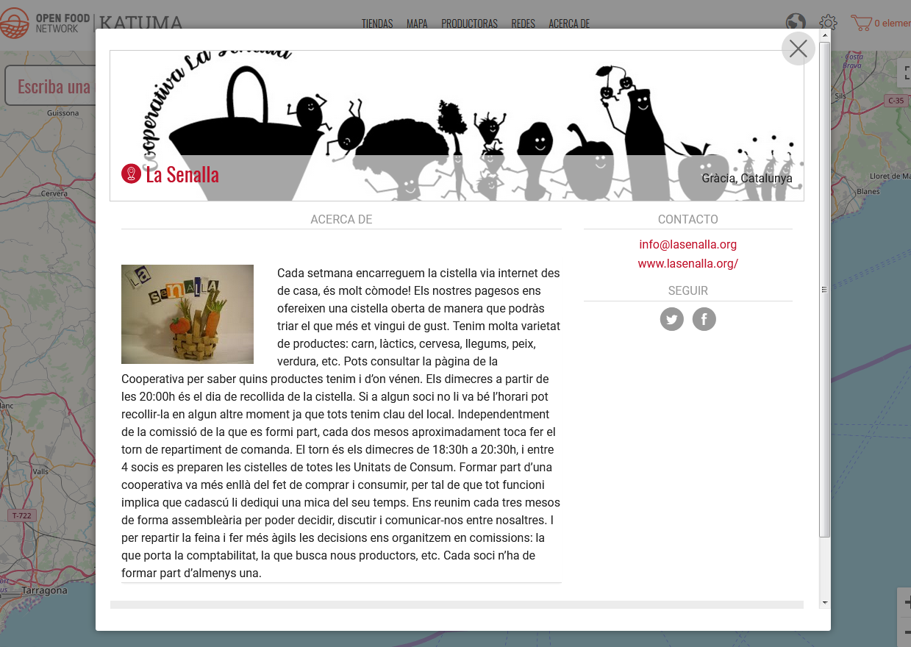

# Grup \(només perfil\)

## Què és un perfil de grup? 

* És un lloc per explciar la vostra història a gent que està interessada en organitzacions i empreses d'alimentació local.
* Sereu visibles al mapa de Katuma.
* Si mai voleu vendre online, podreu afegir la funcionalitat de la botiga al vostre perfil.

## Què fa un perfil de grup? 

**Us fa visibles** Quan teniu un perfil a Katuma edeveniu visibles en el moviment alimentari loca. Sou fàcils de contactar per a les consumidores que volen comprar-vos. També sou accessibles a altres organitzacions que volen proveir-vos, col·laborar o distribuir a través vostre.

## Passos per configurar un perfil de grup

1\) [Registreu el vostre perfil](https://guia.katuma.org/~/edit/drafts/-LXOEI7LbncM3lSwaKIo/basic-features/register-and-create-your-profile) a Katuma. Aquesta eina us demanarà informació sobre la vostra organització per crear el vostre perfil. Se us demanarà que confirmeu el correu electrònic.

2\) Seleccioneu el [tipus de perfil](https://guia.katuma.org/~/edit/drafts/-LXOEI7LbncM3lSwaKIo/basic-features/tipus-de-perfils-disponibles) 'perfil de grup'.

### Heu completat el vostre perfil bàsic!

**Si voleu editar el perfil o afegir-hi més detalls, podeu fer-ho.**

3\) Modifiqueu la vostra [configuració de l'organització](https://guia.katuma.org/~/edit/drafts/-LXOEI7LbncM3lSwaKIo/basic-features/configuracio-de-lorganitzacio).

### Molt bé, has acabat la configuració! 

Ara teniu espai per explicar la història de la vostra organització i per connectar el perfil amb les vostres xarxes socials i presència online.

## Funcionalitats avançades que són d'utilitat per perfils de grups 

**Voleu configurar una botiga en línia?Want to setup an online shop?** Ara teniu un perfil a Katuma. Amb només unes passes més podeu obrir la vostra botiga en línia. Vegeu el manual de configuració per a [grups amb botiga](https://guia.katuma.org/~/edit/drafts/-LXOEI7LbncM3lSwaKIo/manuals-de-configuracio/grup-botiga). Ja heu completat el pas 1 si us heu registrat i creat el perfil, així que podeu començar pel pas 2.

