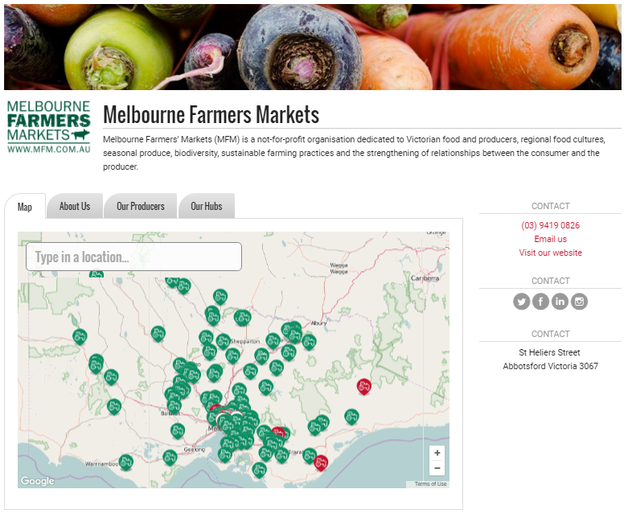

# Mercats de pagès \(Pàgina de grup\)

## Què és una pàgina de grup de mercat de pagès?

• És un mini-directori dels paradistes d’un mercat

• Té un mapa interactiu i un llistat de totes les paradistes, amb un perfil únic per a cadascú

• Permet a totes les paradistes configurar i mantenir el seu perfil, reduint la necessitat d'una administració central.

## Què fa?

**Un lloc on explicar històries**. 

Un directori us permet compartir perfils dels vostres membres amb la vostra comunitat. Inclou la seva història, la seva ubicació i les dades de contacte. És un lloc interactiu perquè les consumidores tinguin més informació sobre les productores que participen en el seu mercat i d’on procedeix el menjar. El directori es pot incorporar a la vostra pàgina  web.

\*\*\*\*

## Passos per configurar una pàgina del grup de mercat de pagès

La configuració d'una pàgina d’un mercats de pagès a Katuma és un procés de dues parts: 

1. Creeu una pàgina de grup: això és un directori de totes les productores que participen al\(s\) mercat\(s\).

 2. Afegiu els perfils de les paradistes a la pàgina del grup: potser haureu de crear perfils per a paradistes tot i que ho poden fer elles mateixes.

## **Pas 1: Crear una pàgina de grup**

Si gestioneu o esteu implicades en un mercat de pagès i voleu crear un grup a Katuma el primer pas és contactar-nos i configurarem una pàgina per a vosaltres. La pàgina del vostre mercat de pagès serà un directori personalitzat de les organitzacions que participen en els vostres mercats. Per exemple, podeu donar un cop d’ull a la pàgina australiana  dels [mercats de pagès de Melbourne](https://openfoodnetwork.org.au/groups/melbourne-farmers-markets#/map), aquí a sota.

Un cop s’ha creat una pagina del grup, podeu personalitzar-la amb els vostres continguts, incloent-hi un “sobre nosaltres”, logos i fotografies. Per a més detalls sobre la gestió dels continguts de la pàgina del vostre grup [cliqueu aqu](https://guia.katuma.org/funcionalitats-avancades/grups/pagina-de-grup)i.

## **Pas 2: Introduiu els perfils de les paradistes a la pàgina del grup.**

Un cop configurada la pàgina del vostre grup, el següent pas és afegir els perfils de les organitzacions que conformen el grup, inclosos els mercats en si i les paradistes. Podeu crear un perfil per al\(s\) vostre\(s\) mercat\(s\) seguint els passos 1-4  del manual del[ manual de configuració d'una botiga de grup](https://guia.katuma.org/manuals-de-configuracio/grup-botiga)  i després afegint els perfils al grup. També podeu afegir tots els perfils de paradistes que ja es troben a Katuma, només cal buscar-les a la pàgina d’administradora del grup. Hi ha dues opcions per configurar perfils per als vostres membres que ja no tenen un perfil a Katuma.

### **Opció 1 – Crear perfils per als vostres membres**

Qui gestiona el mercat de pagès pot optar per configurar perfils per a les  paradistes en nom seu. Aquesta opció és interessant donat que obtindreu una configuració ràpida dels vostres membres i tindreu alguna cosa per mostrar per ajudar-les a visualitzar-se en el nou directori.

Aquí teniu [link](https://guia.katuma.org/basic-features/creeu-o-connecteu-vos-amb-les-vostres-productores-proveidores) a la secció de la guia que descriu com crear diversos perfils per a productors.

Si heu triat aquesta opció, és una bona idea configurar aquests perfils com a "invisibles" fins que no estigueu llestes per llançar la nova pàgina del grup. Quan el mercat s’obre,  enviaran un correu electrònic als membres. Una part d’aquest procés consisteix a oferir als membres l’opció d’apoderar-se dels seus perfils, per tal de mantenir-los al dia. Aquest correu electrònic és una bona oportunitat per explicar el propòsit  del grup i convidar a la participació.

Per a transferir la propietat d’un perfil a la paradista, editeu el perfil i escriviu el correu electrònic de la paradista al camp de “notificació” a la pestanya “usuaris”. Això activarà un correu electrònic a aquesta adreça i, quan es confirmi, aquella usuària es convertirà en la "gestora" d'aquest perfil, i tindrà la plena capacitat per iniciar la sessió i modificar-la. Podeu trobar més detalls sobre la transferència de propietat [aqui](https://guia.katuma.org/funcionalitats-avancades/el-teu-perfil/transferir-la-propietat-del-perfil)

### **Opció 2– Inviteu els vostres membres a crear-se els seus propis perfils:**

Com a alternativa, podeu demanar a les paradistes que configurin el seu propi perfil. Poden fer-ho seguint els passos del [manual de configuració de perfil de productora](https://guia.katuma.org/manuals-de-configuracio/productora-nomes-perfil). Quan el perfil estigui configurat, hauran de fer-vos-ho saber per poder-los afegir a la pàgina del grup, a través de l'administradora de la pàgina del grup.

_Nota: demanar als membres que col·loquin les seves preferències en un formulari de google és una bona manera de recollir les seves respostes de manera eficient \(per exemple, si volen tenir la propietat d’un perfil o si s’afegeixen al grup\)._

## **Funcionalitats avançades que poden ser útils a un mercat de pagès amb pàgina de grup.**

Incrusteu la pàgina del grup al vostre lloc web. Les instruccions estan disponibles  a I[ncrustar una pagina de grup](https://guia.katuma.org/funcionalitats-avancades/grups/incrustar-una-pagina-de-grup).

