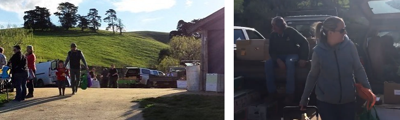

# Pre-comandes amb múltiples productores

## Què son les pre-comandes amb múltiples productores?

Les pre-comandes amb múltiples productores és un model de venda directa de les productores a les consumidores. Aquest model inclou un col·lectiu de productores que gestionen conjuntament una botiga a la plataforma a través de la que reben les comandes. Al treballar conjuntament, les consumidores poden accedir a més varietat de productes des d’un sol lloc, facilitant la comanda. Les productores s’organitzen per a fer les entregues al mateix temps, facilitant d’aquesta manera la recollida per part de les consumidores.

## Què fa?

**Una sola botiga, amb aliments de diferents productores**

Podeu emmagatzemar aliments en un mateix lloc, oferint als clients comoditat i varietat

**Minimitza l'administració central**

Les productores que participen en la botiga poden assolir algunes de les tasques de la botiga, incloent-hi la actualització de la disponibilitat dels seus productes i preus. Això redueix les tasques de l’administradora central. Si les productores no poden assumir aquestes tasques poden optar a que les faci una persona coordinadora.

**Comunica fàcilment amb les productores**

Fes ús dels nostres informes per a fer saber a cada productora les comandes i calcular el total de ventes.

### Un exemple d’aquest model en acció

[Prom Coast Food Collective](https://www.promcoastfoodcollective.com.au/),  és un col·lectiu de productores a Victoria, Australia, que fan servir aquest model per vendre col·lectivament els seus productes. Però com funciona el seu model?

Cada mes el col·lectiu obre la seva botiga online a OFN, que emmagatzema productes de més de 20 productores, abastint una impressionant gama de productes, des de làctics a productes de neteja, carn i verdures. Les consumidores tenen dues setmanes per mirar el que hi ha a la botiga i fer la seva comanda, que no recolliran fins el dia de recollida.  El col·lectiu cobra a través d'una transferència bancaria. També podrien haver fet servir una eina automàtica com Paypal, tot hi que aquesta modalitat comporta comissions.

Quan es tanca el cicle de comanda, la botiga tanca i la persona coordinadora del grup comença a administrar les comandes i els pagaments. Això comporta descarregar l’informe d'OFN amb el llistat de totes les comandes. La coordinadora revisarà que s’hagin rebut totes les transferències de les consumidores per cada comanda. Un cop confirmades, envia a cada productora el llistat amb les comandes que han rebut i fa la transferència amb el valor total de les vendes que ha fet.

En el cas de  Prom Coast, comissionen $5 a cada comanda, cobrint així els costos col·lectius, com el temps dedicat a tasques d’administració.

Una cop que els productors reben el llistat de comandes de la coordinadora, comencen a preparar els productes per a cada consumidora. Això pot implicar processar carn, collir verdures o embalar i etiquetar conserves. Un diumenge al matí, una setmana després que la botiga tanqui i deixi d’acceptar comandes, totes els productores i clients es troben en una de les granges. Les consumidores passen per cada productor i recullen els articles que havien demanat.

Les productores tenen les comandes a punt per a cada client. Com que les comandes es paguen prèviament, no cal fer moviments monetaris. Tingueu en compte que les vendes d'alcohol no es poden pagar prèviament a causa de les llicències de licor, per el que  s'ha de comprar el dia.

Després del dia de recollida, el cicle es repeteix de nou. El primer pas per als productors és iniciar la sessió als seus perfils OFN i actualitzar la disponibilitat i el preu dels seus productes per a les comandes del proper mes. Un cop ho hagin fet, la coordinadora pot obrir la botiga i començar a rebre comandes de nou.

## Passos per a configurar les pre-comandes  amb múltiples productores.

Per configurar aquest model cal, en primer lloc, establir una Botiga de Grup per a la botiga col·lectiva. En segon lloc, cal crear perfils per a totes les productores participants.  A continuació es descriuen aquests passos, així com les opcions de configuració.

La configuració de la botiga col·lectiva és la mateixa que es pot establir  per a una botiga.

1\) [Registreu el vostre perfil](https://guia.katuma.org/basic-features/register-and-create-your-profile) a Katuma. Aquesta eina de configuració us demanarà informació bàsica sobre la vostra organització per crear el perfil. S'us demanarà que confirmeu el correu electrònic.

2\) Seleccioneu el [tipus de perfil](https://guia.katuma.org/basic-features/tipus-de-perfils-disponibles) 'botiga productora'.

3\) Si voleu editar el perfil o afegir-hi més detalls podeu modificar la [Configuració de l'organització](https://guia.katuma.org/basic-features/configuracio-de-lorganitzacio). També podeu configurar les vostres preferències, escollir si la vostra botiga és oberta al públic o privada a les vostres consumidores registrades i escriure un missatge que apareixerà a la botiga.

4\) Definiu i configureu els vostres [mètodes d'enviament](https://guia.katuma.org/basic-features/metodes-denviament).

5\) Definiu i configureu els vostres mètodes de pagament.

6\) Definiu qualsevol [comissió de l'organització](https://guia.katuma.org/basic-features/comissions-de-lorganitzacio) que vulgueu aplicar a la botiga. Per exemple, si teniu una coordinadora central,  pot ser que vulgueu posar una petita quota per cobrir el seu temps.

**7\) Els perfils de les productores i productes.**

Abans de poder afegir els productes a la botiga, cada productora participant ha de tenir un perfil al que es poden relacionar els productes. Hi ha diferents maneres de configurar els perfils de productores, depenent del control que vulgui mantenir la coordinadora central i de quan temps disposen per a configurar els perfils.

**a\) l’Opció amb una implicació alta de la coordinació** 

Si teniu una coordinadora central que tingui la funció de configurar la botiga, pot [crear perfils per a les productores](https://guia.katuma.org/basic-features/creeu-o-connecteu-vos-amb-les-vostres-productores-proveidores). Requereix més temps per a la coordinadora, però permet tenir un control perquè la configuració dels perfils sigui correcta i visualment atractiva. Abans de fer-ho, la coordinadora hauria de de notificar-ho a les productores i obtenir informació sobre el seu perfil. Aquesta opció també pot ser necessària per a productores que no estiguin familiaritzades  amb la tecnologia i que s'involucren d'una altra manera.

Si les vostres productores ja tenen perfils, heu de [connectar amb elles](https://guia.katuma.org/basic-features/creeu-o-connecteu-vos-amb-les-vostres-productores-proveidores). La productora pot concedir diferents nivells de permisos a la botiga, heu de comunicar si voleu accedir a emmagatzemar els seus productes a la vostra botiga o si també voleu editar el seu perfil i els seus productes o afegir els seus productes a l’inventari... Quan la coordinadora central crea perfils per a les productores, també pot afegir la gamma de productes en nom seu. Primer haurà d’obtenir llistes de productes de cada productora, amb els camps obligatoris \(nom, preu, categoria, propietats, etc.\). Consulteu les instruccions per [configurar productes](https://guia.katuma.org/basic-features/productes). Si us heu connectat a un perfil existent, també haureu de tenir permís per editar els seus productes.

**b\) L’opció amb una implicació baixa de la coordinació** 

Si voleu que les vostres productores es responsabilitzin de la creació dels seus perfils, podeu demanar-les que creïn el seu propi perfil i que el puguin afegir. Poden seguir el [manual de configuració de productor](https://guia.katuma.org/manuals-de-configuracio/productora-nomes-perfil) \(només el perfil\)  realitzant els 5 passos.

Si esteu connectades amb els perfils de les productores existents, recordeu a aquestes que actualitzin els seus productes.

Un cop  que les productores hagin configurat els perfils, haureu de [connectar amb elles](https://guia.katuma.org/basic-features/creeu-o-connecteu-vos-amb-les-vostres-productores-proveidores).

9\) Obriu la vostra botiga obrint un cicle de comandes. Una vegada configurats els perfils de  les productores subministradores, amb els seus productes i un cop configurats els mètodes d’enviament i pagament, podeu obrir la vostra botiga creant un cicle de comandes.

10\) Veure i editar [comandes](https://guia.katuma.org/basic-features/veure-comandes)

11\) Veure [informes](https://guia.katuma.org/basic-features/informes).  Podeu utilitzar els informes per generar fulls d'embalatge o repartiment, factures o llistes de correu.

**Quins informes són útils per a botigues amb múltiples productores?**

Generalment, al tancar un cicle de comandes, la coordinadora central haurà de responsabilitzar-se de notificar  a cada productora quantes existències han encarregat per ells i per quin client. A continuació, cada productora pot embalar les existències preparades per a la seva distribució.

L’informe total del cicle de comandes enumera la comanda de cada consumidora, amb cada producte que han demanat. L’informe s’ha de filtrar per  productora i descarregar-lo com a CSV. Això li dirà a la productora quins articles han demanat les consumidores.

Aquest informe també es pot utilitzar per calcular el valor total dels productes sol·licitats per part d'aquesta proveïdora. Si la vostra botiga fa el pagament al final de la compra \(amb Paypal o Stripe\), la coordinadora central pot utilitzar aquest informe per calcular quants diners cal pagar a cada proveïdora.

## Quins són els processos per executar aquest tipus de models?

### Actualització de productes de cada cicle

Abans de cada cicle de comandes, cal actualitzar la disponibilitat i els preus dels productes per a cada productora. Si la coordinadora és propietària dels perfils de les productores, haurà de contactar amb cada productora, obtenir una llista de tots els canvis en els preus i la disponibilitat del producte i actualitzar-ho a Katuma. Si la coordinadora ha adoptat l’opció d’una implicació baixa, les productores hauran de responsabilitzar-se d’actualitzar elles mateixes la informació del seu producte.

A continuació, es mostren les instruccions sobre com les productores poden actualitzar els productes abans d’un cicle de comanda:

A cada cicle hi ha 3 coses per actualitzar abans que obri la botiga:

1\) Marqueu qualsevol producte que no estigui disponible amb un zero al camp "a la mà".

2\) Per als productes que estaran disponibles a la setmana que ve, realitzeu una de les accions següents:

i\) Introduïu la quantitat que teniu disponible al camp "a mà" al costat del producte.

ii\) o, si teniu disponible una quantitat inesgotable d’un producte, seleccioneu la casella de selecció “a demanda” que correspon amb aquest producte.

3\) Actualitzar els preus

Consulteu [aquí ](https://guia.katuma.org/basic-features/productes)per obtenir detalls sobre l’actualització de productes.

Un cop totes els productores ho han fet, la coordinador crea un cicle de comanda i selecciona tots els productes per a totes les productores. D’aquesta manera, s’inclouran tots els productes disponibles a la botiga als preus correctes, amb els nivells d’estoc correctes.

### Crear un cicle de comanda

És la coordinadora qui ha d’assegurar-se que el cicle de comanda es configura correctament. Es tracta d’establir les dates d’obertura i tancament i seleccionar quines productors participen en aquest cicle de comandes.

Una manera d’agilitzar aquest procés és duplicar el cicle de comandes anterior i, a continuació, fer modificacions més petites.

### Devolucions

El col·lectiu hauria de definir la política de reembossament. Per reduir el temps d’administració, espot optar per no permetre cap devolució. O si es permeten devolucions, heu d’aclarir qui es responsabilitza d’aquestes. Per exemple, abans que el col·lectiu hagi pagat les comandes a la productora, seria responsabilitat d’aquest l'administració de les restitucions. Els reemborsaments sol·licitats després de la transferència a les productores o bé després de la data de recollida haurien de ser responsabilitat de les productors, per exemple.

### Funcionalitats avançades

Un cop completada la configuració bàsica, consulteu les funcionalitats avançades, que són especialment rellevants per a les botigues amb múltiples productores:

* [Comissions de l'organització:](https://guia.katuma.org/basic-features/comissions-de-lorganitzacio) les botigues amb múltiples productores poden desitjar utilitzar aquesta eina per assignar taxes i despeses a les parts que presten un servei \(com ara enviament o distribució\) de les quals es beneficien les altres parts.
* Gestorse múltiples: una botiga amb múltiples productores pot tenir diverses gestores capaçes d'iniciar la sessió i editar la botiga. Això es pot fer afegint gestores al perfil de la productora central. Consulteu "usuaris" a la [configuració de la organització.](https://guia.katuma.org/basic-features/configuracio-de-lorganitzacio)
* [Posar preus a productes irregulars o indivisibles](https://guia.katuma.org/funcionalitats-avancades/productes/posar-preu-a-productes-indivisibles-o-irregulars), com ara la carn - Aquesta pàgina ofereix algunes estratègies per fixar preus sobre articles com pollastres o carbasses, que es carreguen per kg però que tenen un pes irregular.
* Apliqueu [etiquetes](https://guia.katuma.org/funcionalitats-avancades/configuracio-de-la-botiga/etiquetes-i-regles-de-les-etiquetes) als vostres clients i personalitzeu la seva experiència amb les regles de les etiquetes. Això pot possibilitar restringir determinats productes i determinats mètodes d’enviament o pagament a determinades consumidores, cosa que resulta especialment útil si teniu consumidores al detall i a l’engròs.
* Fer que la vostra [botiga sigui privada](https://guia.katuma.org/funcionalitats-avancades/configuracio-de-la-botiga/botiga-privada): si preferiu comprovar la idoneïtat de les consumidores \(per exemple, dins dels límits de lliurament o membres inscrits\) abans que puguin fer la comanda a través de la vostra botiga, podeu fer que la vostra botiga estigui limitada als clients homologats.
* [Establiu preus diferents a diferents consumidores](https://guia.katuma.org/funcionalitats-avancades/configuracio-de-la-botiga/preu-especific-segons-el-tipus-de-client): hi ha diverses maneres de configurar la botiga de manera que carregueu preus diferents a clients diferents, com ara els vostres clients rurals i els vostres clients metropolitans.
* Realitzeu [comandes manualment:](https://guia.katuma.org/funcionalitats-avancades/comandes/crear-comandes-manualment) per a les consumidores que prefereixen enviar comandes per text o per telèfon.  

