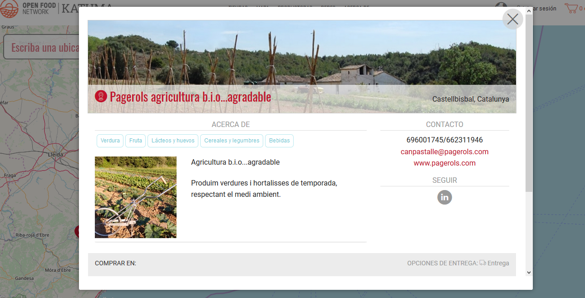

# Productora \(només perfil\)

## Què és un perfil de productora?  

* Un perfil us dona un lloc on explicar la vostra història.
* Sereu visible al mapa de Katuma.
* Sereu visibles en el directori de proveïdores de Katuma.
* Podreu afegir els vostres productes i/o permetre que altres botigues de Katuma els emmagatzemin a les seves botigues.
* Si voleu gestionar la vostra pròpia botiga, podreu afegir la funcionalitat de botiga en línia al vostre perfil.

## Què fa un perfil de productora?  

**Us fa visibles** Quan teniu un perfil a Katuma se us fa visibles en el moviment d'alimentació local. Esdeveniu fàcils de contactar per a les consumidores que volen accedir als vostres productes. I també esdeveniu accessible per a altres organitzacions que vulguin col·laborar amb vosaltres o distribuir els vostres productes.

**Us permet proveir altres botigues** Si voleu proveir una botiga a Katuma podeu crear el vostre perfil i després pujar-hi el vostre llistat de productes. La botiga que proveïu podrà veure els vostres producte i afegir-los les seves botigues en línia de Katuma.

## Passos per configurar un perfil de productora  

1\) [Registreu el vostre perfil](https://guia.katuma.org/basic-features/register-and-create-your-profile) a [Katuma](https://app.katuma.org/register/auth#/signup?after_login=%2Fregister). Aquesta eina de configuració us demanarà informació bàsica sobre la vostra organització per crear el perfil. Se us demanarà que confirmeu el correu electrònic.

2\) Seleccioneu el [tipus de perfil](https://guia.katuma.org/basic-features/tipus-de-perfils-disponibles) 'perfil productora'.

**El vostre perfil bàsic s'ha completat!**

**Si voleu editar el perfil o afegir-hi més detalls podeu fer-ho.**

3\) Modifiqueu el vostre perfil a [Configuració de l'Organització](https://guia.katuma.org/basic-features/configuracio-de-lorganitzacio). És una bona idea afegir propietat sobre els vostres productes \(per exemple: ecològic, segell CCPAE, IGP, pastura lliure...\)

Ara teniu un espai per explicar la història de la vostra organització o empresa i per ajudar a establir les connexions amb les vostres xarxes socials i presència online.

**Si voleu proveir una altra botiga a Katuma dels vostres productes:**

4\) [Afegiu el vostre llistat de productes](https://guia.katuma.org/basic-features/productes).

5\) Concediu a la botiga que voleu proveir els [permisos](https://guia.katuma.org/funcionalitats-avancades/col-laboracio-amb-altres-organitzacions/permisos-e2e-enterprise-to-entreprise) per emmagatzemar els vostres productes.

## Funcionalitats avançades que són útils per a perfils de productores.  

* Fes el teu perfil[ cercable per categoria dels productes](https://guia.katuma.org/funcionalitats-avancades/el-teu-perfil/fer-un-perfil-de-productora-cercable-per-categoria-de-producte).​

**Voleu configurar una botiga en línia?** Ara que ja teniu perfil a Katuma, amb només unes quantes passes de configuració més podeu obrir la vostra pròpia botiga en línia. Vegeu el manual de [Productora \(botiga\)](https://guia.katuma.org/manuals-de-configuracio/productora-botiga). Vosaltres ja heu completat el pas 1 creant el vostre perfil, així que podeu començar pel pas 2 i canviar el vostre tipus de perfil.

